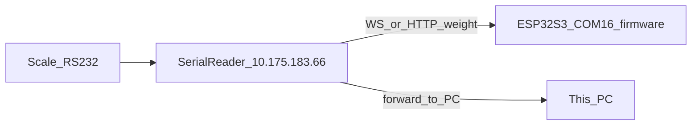

# Two-hour hardware validation: COM16 ESP32-S3, reader 10.175.183.66, scale on serial

## Recommended executor (agent)

Use **Cursor Agent in Agent mode** (full tool access: shell + file edits), **not** Explore (read-only) or Plan-only.

If you prefer a **subagent** from the Task launcher, use **`generalPurpose`**: it can run Windows/PowerShell checks (HTTP, serial capture, optional `pio device monitor`), correlate logs, and append structured rows to markdown—matching this session’s mix of **runtime evidence** and **documentation**.

**Why not other types:** `explore` cannot update [docs/task-logs/TASK-display-serial-bridge-network.md](docs/task-logs/TASK-display-serial-bridge-network.md) or [docs/task-logs/TASK-mandatory-roadmap-decision-log-workflow.md](docs/task-logs/TASK-mandatory-roadmap-decision-log-workflow.md). `shell`-only is awkward for narrative decision-log tables. `cursor-guide` is irrelevant here.

---

## Hard constraint: no product changes

- **Forbidden:** edits under `src/`, `interface/src/`, `lib/`, [platformio.ini](platformio.ini), factory defaults, scripts that alter firmware behavior, etc.
- **Allowed:** updates **only** to the two task-log files named above (working documents per [.cursor/rules/task-roadmap-decision-log.mdc](.cursor/rules/task-roadmap-decision-log.mdc) and [docs/task-logs/README.md](docs/task-logs/README.md)).

---

## System under test (from existing logs + your description)

- **Reader:** `http://10.175.183.66/` (LAN); likely WebSocket endpoint used by forwarder (historically `ws://10.175.183.66/ws/serial` in [docs/task-logs/TASK-display-serial-bridge-network.md](docs/task-logs/TASK-display-serial-bridge-network.md)).
- **This project:** ESP32-S3 on **COM16** running `env:esp32s3` firmware (SerialWriter + SerialWriterForwarder per same task log).
- **PC path:** whatever “forwards to this PC” means in your bench (e.g. USB serial terminal, TCP tool, or browser)—the plan treats this as an **explicit checklist item** to observe live weight lines.

---

## Hardware inventory (before minute 0)

Confirm physically and note **make/model/COM/baud** in both logs:

| Item | Purpose |
|------|--------|
| Scale | Source of weight strings |
| Cabling to reader | RS232/USB-TTL as installed |
| Serial reader host | `10.175.183.66` reachable from PC LAN |
| ESP32-S3 | **COM16**, USB data cable |
| PC ↔ scale/reader side | Path that should show forwarded weight on PC |

---

## Two-hour timeline (actionable)

### Block A — 0:00–0:25 — Connectivity and reader sanity

- From PC: ping or `Test-NetConnection 10.175.183.66 -Port 80` (or your reader’s port); record **pass/fail** and latency if useful.
- `Invoke-WebRequest http://10.175.183.66/` (or browser): note **HTTP status**, whether UI loads, and any obvious scale/serial status indicators.
- If you use a **WebSocket test client** (optional, no repo changes): connect to the same path the firmware uses; confirm **frames** when scale updates (reduces “is it WiFi vs reader?” ambiguity).

**Document:** new dated subsection in **display task** §2 (decision log) + one **roadmap/decision** row in **mandatory workflow** file for “pre-test LAN + reader HTTP”.

### Block B — 0:25–0:55 — End-to-end: scale → reader → ESP32-S3 (COM16)

- Close other COM16 consumers; open **USB serial monitor** at **115200** (per existing §2.9 notes in display task log).
- Capture a **short log excerpt** (boot snippet + WiFi IP + forwarder lines). Prior logs reference device IP **`10.175.183.115`**—treat as **example**; record **actual** IP this session.
- Exercise scale: stable weight, step change, rapid changes if safe.
- Watch for known failure signatures already documented: **`WS disconnected`** storms, **`HTTP auth failed`**, **`Stopping Serial1` / `Config updated` between every line** (should be absent post-fix), leading **`à`** on UART (post-§2.12).

**Document:** table row(s) under display task **§3.4 Validation evidence** and/or new **§2.x** decision entry with **symptom / evidence / conclusion**. Mirror a **one-row summary** in mandatory workflow decision log with **cross-link** to the display task section.

### Block C — 0:55–1:25 — “Forwards to this PC” path + REST/UI spot-check (read-only)

- On PC, observe the **reader→PC** forward path (terminal, app, or network tool—whatever your deployment uses). Align **baud/parity** with reader output if serial.
- Optional **read-only** REST checks against the ESP (if LAN allows): e.g. sign-in + GET state endpoints you already used in §2.11—**no POST that changes config** unless you intentionally want to mutate production settings (default: **avoid** to stay non-invasive).
- If you open the device web UI: **observe only**; do not rely on changing settings during this 2h box unless pre-approved.

**Document:** explicit pass/fail for “PC sees forwarded weight” in both logs.

### Block D — 1:25–2:00 — Soak / edge cases + wrap-up

- **WiFi stress (light):** brief AP/router visibility change or walk distance if safe; note correlation with **`WS disconnected`** vs stable operation (ties to §2.13 narrative in display log).
- **Soak:** continuous updates **≥15–20 minutes** while noting drops, duplicates, or UART glitches.
- **Wrap-up:** update display task **§1.1** checkboxes (e.g. “end-to-end on hardware”) from `[ ]` to `[x]` only if evidence supports it; leave **sign-off** unchecked until you explicitly approve.
- Update mandatory workflow **Active workstream** bullets: mark **pending user sign-off** items with **today’s evidence** or “still pending” with reason.

---

## What to write in each file (so the agent does not drift)

### [docs/task-logs/TASK-display-serial-bridge-network.md](docs/task-logs/TASK-display-serial-bridge-network.md)

- Bump **Last updated** date.
- Add **§2.x (2026-04-22)** — chronological decision log: inventory, each block’s commands/observations, failures (e.g. COM busy), learnings.
- Refresh **§3.4 Validation evidence** and **§1.1** pending items based on facts only.

### [docs/task-logs/TASK-mandatory-roadmap-decision-log-workflow.md](docs/task-logs/TASK-mandatory-roadmap-decision-log-workflow.md)

- Add **Active workstream** bullet for **2026-04-22 — COM16 + reader 10.175.183.66 field validation (no code)**.
- Add **Decision log** table row(s): *What was tried / Why / Outcome / Failure / Learned* per [task-roadmap-decision-log.mdc](.cursor/rules/task-roadmap-decision-log.mdc).

---

## Success criteria (minimum bar for “2h test succeeded”)

- Reader **HTTP** reachable from PC; scale movement produces **observable** data at reader (UI or WS).
- COM16 log shows **stable forward path** for the session (no unbounded reconnect storm; auth errors explained by environment if any).
- **PC forward path** observed at least once with correct-looking weight strings.
- Both task logs updated **same day** with enough detail that another developer can reconstruct the run.

---

## Out of scope (explicit)

- Changing firmware, reader firmware, or network appliances to “fix” issues during this box—**log and defer** instead (per user: no code changes).
- Promoting anything to official docs outside `docs/task-logs/` (per workflow rule).
