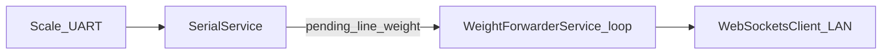

# Debug-session plan: safe optimization, COM10 flash, 2-hour WS soak

## Context (from repo)

- **Board / flash target:** [`platformio.ini`](c:\Projects%20-%20Copy\Weighsoft.Hardware.Base\platformio.ini) `default_envs = esp32wroom32d`; `[env:esp32wroom32d]` uses `upload_protocol = esptool` and **`upload_port = COM10`** (overrides the shared `[env]` OTA defaults). “Latest firmware” = **clean build of current `HEAD` + working tree** for `esp32wroom32d`, then upload.
- **Critical path you must not break:** Scale on **Serial1** → [`SerialService`](c:\Projects%20-%20Copy\Weighsoft.Hardware.Base\src\examples\serial\SerialService.cpp) (bounded RX, validation, publish) → [`WeightForwarderService`](c:\Projects%20-%20Copy\Weighsoft.Hardware.Base\src\examples\weightforwarder\WeightForwarderService.cpp) (**deferred** `forwardWeight` from `onSerialWeightUpdate`, `flushPendingSerialForward()` early in `loop()` after `_wsClient->loop()`) → **outbound WebSocket client** to LAN (your “serialwriter” = WS server).
- **Loop ordering contract** (do not regress without re-proving with logs): [`main.cpp`](c:\Projects%20-%20Copy\Weighsoft.Hardware.Base\src\main.cpp) runs `esp8266React->loop()` then **`weightForwarderService->loop()` before `serialService->loop()`** — this is documented as fixing starvation / errno **11** (`EAGAIN`) storms in [DECISION-LOG-serial-scale-instance-1.md](c:\Projects%20-%20Copy\Weighsoft.Hardware.Base\docs\drafts\DECISION-LOG-serial-scale-instance-1.md) §9.5 **#9** and follow-ons **#11–#19**.

## “Optimization” definition for this debug chat (safe scope)

Treat **optimization** as **stability + observability + measured tuning** on the hot path already under investigation — **not** broad refactors, UI churn, or official `docs/` promotion (still blocked per existing policy in the decision logs).

**In-bounds examples**

- **Build / hygiene:** `python -m platformio run -e esp32wroom32d` after every change; fix compile issues immediately; avoid touching unrelated services.
- **Evidence-led tuning only:** adjust `SERIAL_*` / `WS_TXRX_*` / forwarder throttle constants **only** when Serial evidence shows a specific failure mode (see §9.3 symptom table in the serial-scale log). Prefer **build-flag overrides** in `platformio.ini` for one-off experiments, then fold defaults only after a successful soak.
- **Instrumentation hygiene:** if `AGENTDBG` NDJSON on Serial0 is too noisy for long runs, add a **compile-time gate** (e.g. existing feature-flag pattern in [`features.ini`](c:\Projects%20-%20Copy\Weighsoft.Hardware.Base\features.ini) / `-D…`) so production-like builds can disable verbose probes **without** changing runtime behavior of forwarding logic.
- **`device_id`:** ensure outbound JSON still matches expectations in [DECISION-LOG-weight-forwarder-device-id.md](c:\Projects%20-%20Copy\Weighsoft.Hardware.Base\docs\drafts\DECISION-LOG-weight-forwarder-device-id.md) §6 when touching `formatJson` / document size.

**Out-of-bounds (unless you open a separate task)**

- Rewriting Wi‑Fi association logic: [DECISION-LOG-wifi-sta-connectivity.md](c:\Projects%20-%20Copy\Weighsoft.Hardware.Base\docs\drafts\DECISION-LOG-wifi-sta-connectivity.md) notes **REVERTED** framework WiFi files — only document **new** STA symptoms there if they appear during the soak; avoid reintroducing prior experimental merges without explicit approval.

## Flash procedure (COM10, “latest firmware”)

Follow workspace rule [`.cursor/rules/platformio-upload.mdc`](c:\Projects%20-%20Copy\Weighsoft.Hardware.Base\.cursor\rules\platformio-upload.mdc):

1. **Close** anything holding COM10 (Serial Monitor, other Python scripts).
2. `Get-Process python* | Stop-Process -Force` (frees stuck PlatformIO / monitor handles on Windows).
3. Build + upload: `python -m platformio run -e esp32wroom32d -t upload`
4. If upload fails with **Access is denied**, repeat step 1–2; do not assume hardware fault first.

## 2-hour supervised soak test (WebSocket to LAN)

**Objective:** prove **continuous** scale → ESP → **LAN WebSocket** integrity under real traffic, with **no** `abort()`, sustained watchdog stability, and acceptable error/recovery behavior.

**Before start (15 min)**

- Record: git commit hash, `VERSION_STRING` / build banner from Serial boot, `ws_url` (redact secrets), laptop IPv4, Node-RED (or peer) listen address, firewall rule for inbound TCP on the WS port.
- Peer side: enable **message logging** (count + timestamps + full JSON sample every N messages) so you can correlate with ESP `[WeightForwarder] ws_tx_ok` / failures.

**During 2 hours (supervised, not necessarily staring at screen)**

- **Serial0 capture:** tee PlatformIO monitor (115200) to a timestamped log file in repo root (same pattern as `debug-36885a.log` referenced in the serial-scale log §9.4).
- **Automated greps / periodic checks** (e.g. every 10–15 min): counts of `ws_tx_FAIL`, `sendTXT_false`, `Too many messages queued`, `abort`, `Guru Meditation`, `WDT`, `WiFiClient.cpp:429`, `bad_alloc`. Zero tolerance for **panic/abort** unless explicitly triaged and fixed mid-run.
- **Functional spot checks:** REST `GET /rest/weightForwarder` shows expected `device_id`; UI still loads; scale weight changes still produce peer JSON within `MIN_FORWARD_INTERVAL` expectations.

**After 2 hours**

- Summarize: total peer messages, disconnect/reconnect count, worst `main_loop_timing` / `wf_loop_wall` lines if still enabled, min free heap / min `maxAllocHeap` samples, any STA drops (only then update Wi‑Fi decision log per below).

## Documentation requirement (all three drafts)

After **each** meaningful change, flash, or test milestone, append rows — do **not** rewrite history:

| File | What to append |
|------|----------------|
| [docs/drafts/DECISION-LOG-serial-scale-instance-1.md](c:\Projects%20-%20Copy\Weighsoft.Hardware.Base\docs\drafts\DECISION-LOG-serial-scale-instance-1.md) | §8 changelog + §9.5 new attempt row + §9.6 build/upload table: **date (UTC)**, COM10, command, outcome, **log excerpt pointers** (file name / line class), hypothesis proven/disproven |
| [docs/drafts/DECISION-LOG-weight-forwarder-device-id.md](c:\Projects%20-%20Copy\Weighsoft.Hardware.Base\docs\drafts\DECISION-LOG-weight-forwarder-device-id.md) | §5 changelog; tick or annotate §6 checklist items **only** with evidence from the soak (REST + peer JSON showing `device_id`) |
| [docs/drafts/DECISION-LOG-wifi-sta-connectivity.md](c:\Projects%20-%20Copy\Weighsoft.Hardware.Base\docs\drafts\DECISION-LOG-wifi-sta-connectivity.md) | §changelog **only if** the soak shows STA association/auth flaps; otherwise one line stating **“no STA regression observed”** with timestamp |

Cross-linking: when a symptom is **errno 11 / ws_tx / AsyncWebSocket queue**, primary narrative stays in the **serial-scale** log (already distinguishes STA vs outbound WS per §9.3).

## Rollback / safety net

- Keep changes **small and committable** (one concern per commit if using git).
- If a change regresses forwarding: **revert that commit** immediately; re-flash prior known-good binary; log the revert in §9.5 as a failed attempt with reason.
- Do **not** merge duplicate path copies under `src\` vs `src/` if both appear in the working tree — normalize to **one** canonical file set before editing (duplicate files are a high-risk source of “it compiled but the wrong file shipped”).
