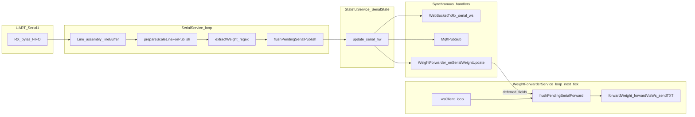

# Serial Reader (ESP32-WROOM-32D / COM10): failure analysis and optimization plan (debug chat)

## Context from your COM10 capture

The snippet shows **STA disconnect reason 201 (`NO_AP_FOUND`)**, `wl=NO_SSID`, `ip=0.0.0.0`, and `wf_heartbeat` with **`wifi:0`**. That pattern means the device is **not associated to an infrastructure AP** (SSID not found / wrong band / AP off / RF), not the same symptom class as **errno 11 / `sendTXT_false` while `WiFi.isConnected()==1`** documented in [docs/drafts/DECISION-LOG-serial-scale-instance-1.md](docs/drafts/DECISION-LOG-serial-scale-instance-1.md) §9.3–§9.5.

**Update (STA up, outbound WS):** A later capture with `wifi:1` showed **`ws_client_loop_slow` ~5005 ms** and **`main_loop_timing` `forwarderMs` ~5037 ms** repeating with **`WS event=DISCONNECTED` … `TCP connection cleanup`**. That duration matches **`WEBSOCKETS_TCP_TIMEOUT` (5000)** in `links2004/WebSockets` (`WebSocketsClient::loop` → `WiFiClient::connect(..., WEBSOCKETS_TCP_TIMEOUT)`). Mitigation in tree: **`platformio.ini`** `-D WEBSOCKETS_TCP_TIMEOUT=1500` and **`setReconnectInterval(3000)`** after `new WebSocketsClient()` so failed peers do not block the whole sketch for 5 s every ~500 ms backoff tick. Peer-side fix (Node-RED path, HTTP vs `websocket-in`, firewall) remains required for a stable connection.

**Implication for “string not seen by serial writer”:** if “writer” means **LAN peer (Node-RED / outbound WebSocket client)**, then with STA down **`forwardViaWs` never succeeds** ([WeightForwarderService.cpp](src/examples/weightforwarder/WeightForwarderService.cpp) gates on `WiFi.isConnected()`). If “writer” means **browser UI over `/ws/serial`**, the ESP can still serve **soft-AP or existing association paths** depending on mode; your health line shows **`mode=APSTA`** so local UI may partially work while **STA path to LAN** is broken.

Treat **WiFi STA loss** and **serial/string integrity** as **orthogonal until logs prove correlation** (e.g. same timestamp as UART errors).

---

## Authoritative architecture (from draft decision logs)

| Source | What to follow |
|--------|----------------|
| [DECISION-LOG-serial-scale-instance-1.md](docs/drafts/DECISION-LOG-serial-scale-instance-1.md) | Bounded UART reads, explicit reject for oversize lines (no silent truncation), drop non-printable during assembly, `prepareScaleLineForPublish` gate, **defer outbound forward** out of `SerialService::update()` chain (#15), **main loop order** WF before Serial (#9), pre-`sendTXT` `_wsClient->loop()` (#9), server WS broadcast throttles + max-alloc gate (#14–#19). |
| [DECISION-LOG-weight-forwarder-device-id.md](docs/drafts/DECISION-LOG-weight-forwarder-device-id.md) | Payload includes `device_id`; `DynamicJsonDocument` size **384** in forward path; downstream parsers must tolerate extra key in display mode. |
| [DECISION-LOG-wifi-sta-connectivity.md](docs/drafts/DECISION-LOG-wifi-sta-connectivity.md) | **Status REVERTED** for `WiFiSettingsService` experiments; still documents **LittleFS overrides factory**, empty-string JSON pitfalls, and **do not conflate** STA association bugs with **outbound WS errno 11** (cross-ref §Outbound WebSocket client). |

**Do not re-litigate** rejected approaches from the serial log (hex-escape into line buffer, silent truncation) when proposing future changes.

---

## End-to-end data flow (step-by-step)

1. **Serial input:** `SERIAL_PORT.read()` in [SerialService.cpp](src/examples/serial/SerialService.cpp) inside a `while` bounded by **`SERIAL_MAX_READ_BYTES_PER_LOOP`** and **`SERIAL_MAX_READ_MS_PER_LOOP`** ([SerialService.h](src/examples/serial/SerialService.h)).
2. **Buffer:** `_lineBuffer` accumulates printable ASCII (+ tab); **`\r` / `\n`** terminate a logical line; non-printable bytes are **dropped** (not escaped—per decision log Attempt 3).
3. **String processing / validation:** `prepareScaleLineForPublish` trims, rejects empty, control-noise heuristic, **`too_long`** if `> SERIAL_MAX_PUBLISHED_LINE_CHARS` (512 default).
4. **Weight extraction:** `extractWeight` uses **compiled POSIX regex**; requires a **digit** in capture before `toFloat()`; can return **empty** (valid line but no weight).
5. **Publish to state:** `_pendingPublishLine` / `_pendingWeight` → `flushPendingSerialPublish()` → `update(..., "serial_hw")` after **`SERIAL_MIN_PUBLISH_INTERVAL_MS`** throttle (currently **250 ms** in header).
6. **Forwarding hook:** `WeightForwarderService::onSerialWeightUpdate` runs **synchronously** when `serial_hw` update propagates; it only **copies** `lastLine`/`weight` and sets **`_serialForwardPending`** if weight non-empty ([WeightForwarderService.cpp](src/examples/weightforwarder/WeightForwarderService.cpp) ~337–361).
7. **WebSocket handling (outbound LAN):** Next **`weightForwarderService->loop()`** ([main.cpp](src/main.cpp) L183–187): `_wsClient->loop()` then **`flushPendingSerialForward()`** → `forwardWeight` → `forwardViaWs` builds JSON (`formatJson`, 384-byte doc), **`_wsClient->loop()`** again pre-`sendTXT`, then `sendTXT`.

**Critical dependency:** `main.cpp` runs **framework → forwarder → serial → diagnostics**. This matches the documented mitigation for **TCP drain ordering** (#9).

---

## Failure points and dependencies (with why, likelihood, impact)

**Legend:** Likelihood **H/M/L**; Impact **H/M/L** on “correct weight visible end-to-end / stability”.

### A. RF / STA / configuration (matches your pasted log)

- **A1 — `NO_AP_FOUND` (201), `NO_SSID`, `wifi:0`:** STA cannot see configured SSID (AP off, wrong SSID in `/config/wifiSettings.json`, 5 GHz-only router, distance, regulatory channel). **Why:** ESP32 STA scan/assoc failure. **Likelihood:** **H** in your capture. **Impact:** **H** for **outbound** forwarder to LAN; **M** for NTP/time; **L–M** for local web UI depending on whether you reach the device via AP interface.
- **A2 — LittleFS overrides factory WiFi:** Per [DECISION-LOG-wifi-sta-connectivity.md](docs/drafts/DECISION-LOG-wifi-sta-connectivity.md). Wrong persisted JSON → same symptom. **Likelihood:** **M** across deployments. **Impact:** **H** until corrected.
- **A3 — Confusing “two WebSockets”:** UI “WebSocket” = **browser ↔ ESP AsyncWebServer**; forwarder = **ESP WebSocketsClient ↔ LAN**. STA down breaks only the second. **Likelihood:** **M** (operator interpretation). **Impact:** **M** (false debugging target).

### B. UART / line assembly / parsing

- **B1 — UART FIFO overflow if loop starved:** Bounded reads reduce risk; if **global** `loop()` stalls (other services, ISRs, flash), bytes can still be lost. **Why:** hardware FIFO depth finite. **Likelihood:** **L–M** under extreme flood + stalls. **Impact:** **H** (partial line → reject or wrong regex).
- **B2 — Dropped non-printable bytes:** Binary framing on same UART loses STX/ETX (documented tradeoff). **Likelihood:** **L** if scale is pure ASCII. **Impact:** **H** if protocol is binary.
- **B3 — Line buffer reset at 2048 chars:** Runaway line without terminator clears buffer—**data loss** for that frame. **Why:** memory cap. **Likelihood:** **L** for normal scales. **Impact:** **M** (missing update).
- **B4 — `too_long` / `control_noise` / `empty` reject:** Line never updates `lastLine`/`weight`. **Why:** validation policy (intentional integrity). **Likelihood:** **M** with noise or wrong `SERIAL_MAX_PUBLISHED_LINE_CHARS`. **Impact:** **M** (“no output”) **without** freeze—distinguish via `[Serial] RX rejected` logs.
- **B5 — Regex compile / match errors / empty capture:** `extractWeight` returns `""` → forwarder **skips** (`skip_forward: empty_weight`). **Why:** pattern mismatch or scale format change. **Likelihood:** **M**. **Impact:** **H** for forward path; serial state may still show `last_line` with empty weight depending on publish path (weight empty still sets pending in current code path—forwarder reads and skips).
- **B6 — `String` churn / heap fragmentation:** Multiple `String` copies in RX, JSON serialize, WS buffers. **Why:** Arduino `String` + frequent allocations. **Likelihood:** **M** under high rate + many listeners. **Impact:** **M–H** (latency, `makeBuffer_null`, rare `bad_alloc` class per log #18).

### C. Cooperative multitasking / blocking

- **C1 — `delay(100)` in `applySerialConfig()`:** Blocks **entire** sketch during reconfig. **Why:** hardware settle. **Likelihood:** **L** except on config change / resume. **Impact:** **L–M** short freeze at reconfig.
- **C2 — `StatefulService` mutex `portMAX_DELAY`:** If a callback blocked while holding transaction, others deadlock—**current** handlers are intended lightweight; risk is **future** heavy work in update handlers. **Likelihood:** **L** today. **Impact:** **H** if introduced.
- **C3 — Long `_wsClient->loop()`:** Documented (#16–#17); starves next services in same `loop()` tick. **Likelihood:** **M** under TCP pressure. **Impact:** **H** for serial sampling cadence + `sendTXT_false`.

### D. Server-side WebSocket (UI) backpressure

- **D1 — `transmitData` skips broadcast if `ESP.getMaxAllocHeap() < WS_TXRX_MIN_MAX_ALLOC_FOR_BROADCAST` (20480):** UI may **not** see every serial update though REST/state may differ. **Why:** protect AsyncTCP/HTTP from `bad_alloc` (#18–#19). **Likelihood:** **M** on BLE partition / low max-block boards. **Impact:** **M** for UI freshness only.
- **D2 — `serial_hw` broadcast throttle (650 ms):** Skips WS fanout; state update still runs. **Likelihood:** **H** when updates faster than throttle. **Impact:** **M** for `/ws/serial` smoothness, not for LAN JSON forwarder.
- **D3 — AsyncWebSocket “Too many messages queued”:** Still a **risk** if listeners + payload rate high. **Likelihood:** **M** (per log). **Impact:** **H** (disconnect / heap pressure).

### E. Outbound WebSocket client (LAN forwarder)

- **E1 — `WiFi.isConnected()` false:** Early exit, `"No WiFi"`—**your COM10 log**. **Likelihood:** **H** in capture. **Impact:** **H** no LAN forward.
- **E2 — `ws_not_ready` / handshake / DNS / wrong URL:** Documented §9 runbook. **Likelihood:** **M** in misconfig. **Impact:** **H** until fixed.
- **E3 — `sendTXT` false + errno 11:** **EAGAIN** / TX not drained; correlates with **`msSinceWfLoop`** large in past logs. **Likelihood:** **M** when STA up but peer slow or loop ordering regresses. **Impact:** **H** (disconnect + backoff).
- **E4 — `MIN_FORWARD_INTERVAL`:** Drops forwards; **latest** sample may be overwritten before flush if multiple lines per interval—**edge case** under very fast scale + slow WF loop. **Likelihood:** **L–M**. **Impact:** **M** (skipped intermediate weights).

### F. Cross-component ordering (documented root causes)

- **F1 — Starvation bugs already fixed:** Unsigned read-budget underflow (#11), nested `forwardViaWs` inside serial update (#15). **Regression risk if refactored.** **Likelihood:** **L** if code stable. **Impact:** **H** if reintroduced.

---

## Verification strategy (before any optimization code)

Align with [DECISION-LOG-serial-scale-instance-1.md](docs/drafts/DECISION-LOG-serial-scale-instance-1.md) §6 / §9.4 sign-off and runbook:

1. **Stabilize STA:** Confirm SSID visible on 2.4 GHz, `/config/wifiSettings.json` on device matches intent (or use AP-only test with a phone/laptop on ESP AP if that is the operational model—then **do not expect LAN forwarder to reach a different subnet**).
2. **Separate symptoms in Serial0:** Correlate **`[WiFi]` / `[Diag][WiFi]`** with **`[WeightForwarder]`** and **`AGENTDBG`** lines (`hypothesisId` **F/C/D/A/L/M/P** per existing instrumentation).
3. **Serial path only:** Confirm `[Serial] RX rejected`, `no_weight_capture`, and line preview when “no output.”
4. **Outbound path only:** After STA green, verify `WS diag`, `CONNECTED`, `ws_tx_ok` vs `ws_tx_FAIL` per §9.3 table.
5. **Stress (Phase E):** Flood + noise tests still **not signed off** in the serial log—required before treating optimizations as validated.

---

## Optimization directions (post-evidence; no code in this phase)

Only pursue after step 1–4 show which bucket dominates:

- **If A dominates (current COM10):** Operational / WiFi persistence / RF—not serial algorithm work.
- **If B dominates:** Tune regex / `SERIAL_MAX_PUBLISHED_LINE_CHARS` / scale wiring; avoid weakening integrity gates without product sign-off.
- **If C–E dominate (historical errno 11 class):** Keep honoring #9/#15 ordering; consider further **rate shaping** or **payload size** only with measured `forwarderMs` / `wf_loop_wall` / `ws_client_loop_slow` evidence; avoid reintroducing blocking patterns rejected in logs.
- **If D dominates:** UI/client-side consumption (fewer tabs, slower polling) + existing throttles; tune **`WS_TXRX_MIN_MAX_ALLOC_FOR_BROADCAST`** only with max-alloc histograms (#19 warning).

---

## Uncertainties (stop here rather than loop)

- **Whether “serial writer” means LAN peer or browser UI** changes which of A vs D vs E applies first—confirm in debug chat.
- **Exact scale line format and regex** on this unit are not in-repo as a single fixture; empty-weight vs reject must be read from live `[Serial]` / `[WeightForwarder]` lines.
- **WiFi decision log is REVERTED:** do not assume experimental `WiFiSettingsService` merge rules from that doc are in the tree; verify actual file state when debugging STA.
