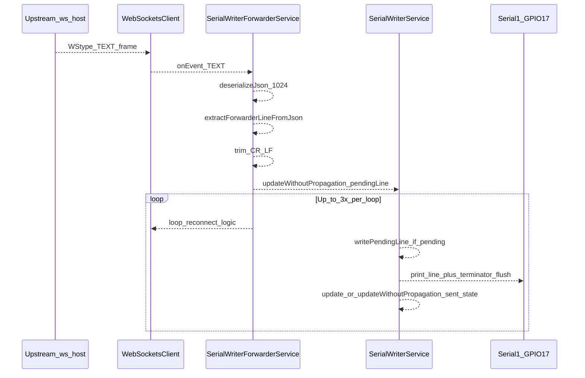

# ESP32-S3 Serial Writer (COM16) — failure-point and optimization planning

## Scope and environment

- **Firmware image:** Single app built by [`platformio.ini`](platformio.ini) `[env:esp32s3]` (default env). **COM16** is the USB upload/monitor port for this board ([`platformio.ini`](platformio.ini) L95–97).
- **Relevant services:** [`src/main.cpp`](src/main.cpp) wires **`SerialWriterForwarderService`** (upstream ingest) → **`SerialWriterService`** (UART on **Serial1**, TX **GPIO17**, RX **GPIO18** per [`SerialWriterService.h`](src/examples/serialwriter/SerialWriterService.h) and [`docs/PLATFORM-GPIO.md`](docs/PLATFORM-GPIO.md)).
- **Guideline docs:** Architectural intent, known regressions, and accepted mitigations are recorded in [`docs/task-logs/TASK-display-serial-bridge-network.md`](docs/task-logs/TASK-display-serial-bridge-network.md) and [`docs/task-logs/TASK-mandatory-roadmap-decision-log-workflow.md`](docs/task-logs/TASK-mandatory-roadmap-decision-log-workflow.md). **This plan defers any code edits** until you provide logs in a follow-up debug session, per your note.

---

## Correct handling strategy (from documentation — do not contradict without new evidence)

The task logs establish these **non-negotiable patterns** for this stack:

1. **One reconnect owner:** `WebSocketsClient::loop()` already reconnects; application code must **not** recreate the client on every disconnect ([`TASK-mandatory-roadmap-decision-log-workflow.md`](docs/task-logs/TASK-mandatory-roadmap-decision-log-workflow.md) — *Forwarder WS reconnect storm*). Current [`SerialWriterForwarderService::checkWsConnection`](src/examples/serialwriter/SerialWriterForwarderService.cpp) only calls `initWsClient()` when `_wsClient == nullptr` and backoff elapsed — **aligned**.
2. **WiFi / mode churn:** Outbound WS connect should be **quiet** after `WiFi.getMode()` changes or STA loss ([`trackWifiForOutboundWsQuiet`](src/examples/serialwriter/SerialWriterForwarderService.cpp)) — **aligned** with §2.13 of the display task log.
3. **No incompatible client heartbeat** toward AsyncWebSocket-style peers — **`disableHeartbeat()`** — **aligned**.
4. **Hot path must not persist UART or flood subscribers:** Forwarder → writer uses **`updateWithoutPropagation`** for `pendingLine`; writer avoids **`onConfigUpdated()`** for `serial_writer_sent`, `init`, `pull_forwarder`, and skips persist/reinit when UART settings unchanged ([`SerialWriterService.cpp`](src/examples/serialwriter/SerialWriterService.cpp)) — **aligned** with §2.12 follow-up in the task log.
5. **Main-loop ordering:** Up to **three** paired **forwarder then writer** passes per frame ([`main.cpp`](src/main.cpp) L131–139) — **aligned** with the roadmap decision log (*string sluggish / loop ordering*).
6. **Propagate throttle:** Full `update(..., "serial_writer_sent")` (WebSocket/MQTT broadcast) at most every **55 ms**; otherwise `updateWithoutPropagation` — **aligned** with *Serial string sluggish + random freezes*.

Any future optimization should **preserve** these; regressions here historically caused **UART reinit storms**, **WS churn**, and **UI/network load**.

---

## Step-by-step data flow (WebSocket upstream → UART)

| Step | What happens | Primary code |
|------|----------------|----------------|
| **1. WebSocket receive** | `WebSocketsClient` delivers `WStype_TEXT` with `payload`/`length` (one frame = one callback for typical text messages). | [`initWsClient` lambda](src/examples/serialwriter/SerialWriterForwarderService.cpp) L380–418 |
| **2. Buffer / parse** | `DynamicJsonDocument doc(1024)` + `deserializeJson(doc, payload, length)`. | Same, L395–397 |
| **3. String processing** | `extractForwarderLineFromJson`: root field, or `type=="payload"` object, optional fallback to `payload.last_line`. | L18–45, L399–402 |
| **4. Validation** | **Implicit only:** non-empty field after trim; `json_field` must match server shape; **`id`** handshake messages are ignored unless they accidentally match extraction rules; **no** max length, charset, or checksum validation on the line. | L404–408; [`SerialWriterState::update`](src/examples/serialwriter/SerialWriterState.h) L130–137 |
| **5. Serial write** | `pendingLine` set → `writePendingLine()` copies line, `SERIAL_WRITER_PORT.print`, terminator, **`flush()`**. | [`SerialWriterService::writePendingLine`](src/examples/serialwriter/SerialWriterService.cpp) L103–147 |
| **6. Output confirmation** | **Not implemented:** there is **no** UART read-back, CTS/RTS flow control, or application-level ACK from the display. **`flush()`** only waits for UART hardware/FIFO; it does **not** prove the downstream device parsed the line. | Same |

---

## Dependencies (external and internal)

| Dependency | Role | If it fails |
|--------------|------|-------------|
| **STA WiFi** | TCP to `ws://host:port/path`; HTTP `signIn` for JWT | No connect / auth storms (mitigated by quiet window + skip init when STA down) |
| **Upstream host** (serial reader / weigh stack) | Emits WebSocketTxRx JSON (`payload`, `last_line`, etc.) | Missing or wrong field → no line; server idle/close → disconnect |
| **JWT in query string** (`access_token=`) | Auth to secured WS | Token expiry → persistent 401 until reconnect path refreshes token (**behavior not fully verified** in code without runtime trace) |
| **LittleFS** | `/config/serialWriterForwarderConfig.json`, `serialWriterConfig.json` | Bad/missing config → wrong URL/field/baud |
| **Links2004 WebSockets** | Client stack, reconnect interval | Library limits (frame size, internal buffers) — **not re-derived here**; if logs show truncation, inspect vendored `WebSocketsClient` |
| **ArduinoJson** | Parse budget 1024 bytes (WS), 512 (HTTP body in poll) | Overflow → parse error |
| **Main loop cadence** | `esp8266React->loop()` then forwarder/writer | Starvation if other work blocks too long |
| **COM16 / USB CDC** | Debug `Serial` at 115200 | Monitor open can block **upload** (documented in task log) |

---

## Failure points — why they occur, likelihood, impact

Scale: **Likelihood** Low / Med / High; **Impact** Low / Med / High (for “string not received / freeze / no UART output”).

### A. Connectivity and auth

| Issue | Why it can occur | Likelihood | Impact |
|--------|-------------------|------------|--------|
| **WS disconnect** | WiFi mode change (e.g. AP/captive portal teardown), STA roaming, TCP idle, upstream restart, incompatible ping policy (mitigated by **no heartbeat**). | Med | High — no new lines until reconnect |
| **`HTTP auth failed`** during WS init | `signIn` called while STA not fully ready, wrong credentials, server down, or COM/port contention causing odd timing. | Low–Med | Med — WS may not get token |
| **JWT expiry on long-lived URL** | Path built once with token; if server rejects expired token, client may reconnect with **same** stale query (**uncertain without server contract**). | Med (long runs) | High if true |
| **Reconnect storm (regression)** | Re-introducing `initWsClient()` on every disconnect would fight the library (**was** a confirmed bug). | Low if code unchanged | High |

### B. Parsing and message shape

| Issue | Why it can occur | Likelihood | Impact |
|--------|-------------------|------------|--------|
| **Wrong `json_field`** vs server | Operator/config mismatch (task log §2.10). | Med (misconfig) | High — “connected but no data” |
| **JSON > 1024 bytes** | Large `payload` or extra fields. | Low–Med | High — **silent drop** (no log on deserialize failure in WS path) |
| **Non-JSON or fragmented logical message** | Malformed upstream, or multi-frame logical message if library ever splits (unusual for TEXT). | Low | High — drop or partial parse |
| **`WStype_TEXT` parse error** | Trailing garbage, wrong UTF-8, truncated frame. | Low | **High** — currently **no** `else` branch after `deserializeJson` in WS handler → **no visibility** |

### C. Buffering, loss, and ordering

| Issue | Why it can occur | Likelihood | Impact |
|--------|-------------------|------------|--------|
| **Single `pendingLine` slot** | Each `deliverLine` overwrites `SerialWriterState.pendingLine` via `updateWithoutPropagation`. | High under burst | **Med–High** — **intermediate lines dropped**; only last survives between writer passes |
| **Duplicate identical line** | `SerialWriterState::update`: `v != state.pendingLine` — repeating the **same** string while still pending may not re-queue (**edge case**). | Low | Low |
| **Timing receive vs write** | Mitigated by triple paired passes; still one **main-loop** quantum between WS callback and UART. | Low | Low–Med latency |

### D. Blocking and watchdog

| Issue | Why it can occur | Likelihood | Impact |
|--------|-------------------|------------|--------|
| **`HTTPClient::GET` / `POST` in `pollHttp`** | Blocks up to **2 s** (`setTimeout(2000)`). | Med when protocol is HTTP | High — stalls forwarder + writer loops |
| **`fetchHttpAuthToken` on WS init** | Synchronous HTTP before `begin()`. | Med on each **new** client | Med — startup or config-change hitch |
| **`delay(500)` / `delay(200)` / `delay(100)` in `setup` / `applySerialConfig`** | Intentional settle / post-`begin`. | Low after boot | Low except during UART reconfig |
| **`Serial.printf` on USB** | Throttled to propagated sends (~55 ms min) but still **USB CDC** work per line. | Med at very high line rate | Med — loop time / jitter |

### E. Memory and `String`

| Issue | Why it can occur | Likelihood | Impact |
|--------|-------------------|------------|--------|
| **Heap fragmentation** | Many `String` temporaries (`extract` `as<String>()`, `deliverLine` copy `t`, HTTP `getString()`). | Med under sustained load | Med — rare allocation failures / instability |
| **Unbounded line length** | No cap on `pending_line` / extracted line. | Low | Med — large alloc + long UART transmit |

### F. UART and physical layer

| Issue | Why it can occur | Likelihood | Impact |
|--------|-------------------|------------|--------|
| **Baud / 8N1 mismatch** on display | Wrong persisted `baud_rate` vs indicator. | Med (ops) | High — garbage or “freeze” perception |
| **Leading garbage (`à` etc.)** | Historically **UART reinit** between bytes; mitigated by not re-opening Serial1 each line. | Low post-fix | Med if regression |
| **`flush()` blocking** | Long strings at low baud extend blocking. | Med | Med — extends loop latency |
| **No flow control** | Downstream buffer overrun. | Low–Med | Med — partial display updates |

### G. Configuration and persistence side effects

| Issue | Why it can occur | Likelihood | Impact |
|--------|-------------------|------------|--------|
| **`onConfigUpdated` UART storm** | Any `originId` not excluded triggers `writeToFS` + `applySerialConfig`. | Low post-fix | **High** if reintroduced |
| **REST/UI `pending_line` with baud change in same POST** | Would trigger persist + reinit — by design when config changes. | Low | Med |

---

## Map to your “last known issues”

1. **WiFi/WebSocket disconnect → string not received:** Consistent with **A**; while disconnected, **no** `deliverLine` calls. After reconnect, upstream must **re-send**; there is **no** client-side replay buffer.
2. **Malformed / delayed / inconsistent string → freeze or no output:** Can be **B** (silent parse failure), **C** (overwritten `pendingLine`), **D** (blocking HTTP), **E** (heap), or **F** (UART mismatch). **“Freeze”** often was **load/watchdog** from propagation/UART storm (**fixed patterns** in G); remaining freezes need **logs** (heap, WS events, line rate).

---

## Optimization directions (for a later implementation pass — not executing now)

Only after correlating with your COM16 logs:

- **Observability:** Log `DeserializationError` and oversize payload hint on WS path; optional counter for dropped lines.
- **Queue vs single slot:** If upstream can burst faster than UART, a **small bounded queue** trades RAM for fewer drops (design tradeoff vs current “latest wins”).
- **Line validation:** Max length, allowed charset, reject embedded control chars (except already-trimmed CR/LF).
- **HTTP mode:** If used, consider shorter timeout or async pattern (larger change).
- **Token refresh:** If logs show auth failures after long uptime, refresh JWT on 401 / before reconnect (**needs explicit design**).

---

## What to capture when issues recur (for the debug chat)

- **COM16** USB log from boot through disconnect (~30–60 s), including **`[SerialWriterForwarder]`** and **`[SerialWriter]`** lines.
- Forwarder **REST** snapshot: `enabled`, `source_url`, `json_field`, `connected`, `last_error`.
- **Writer** config: `baud_rate`, terminator.
- Whether **HTTP** or **WS** protocol is selected.
- Upstream reader **firmware/version** if known (task log says not to change reader from this repo without evidence).

This gives enough signal to distinguish **A** vs **B** vs **C/D** without guessing.
