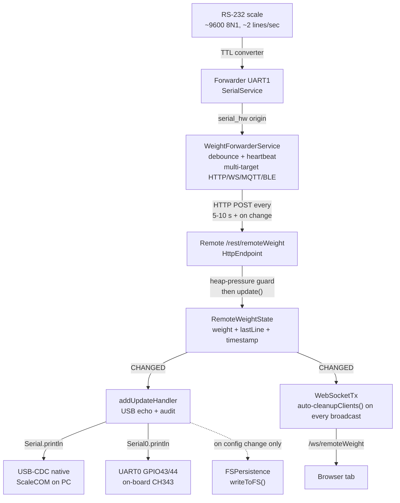
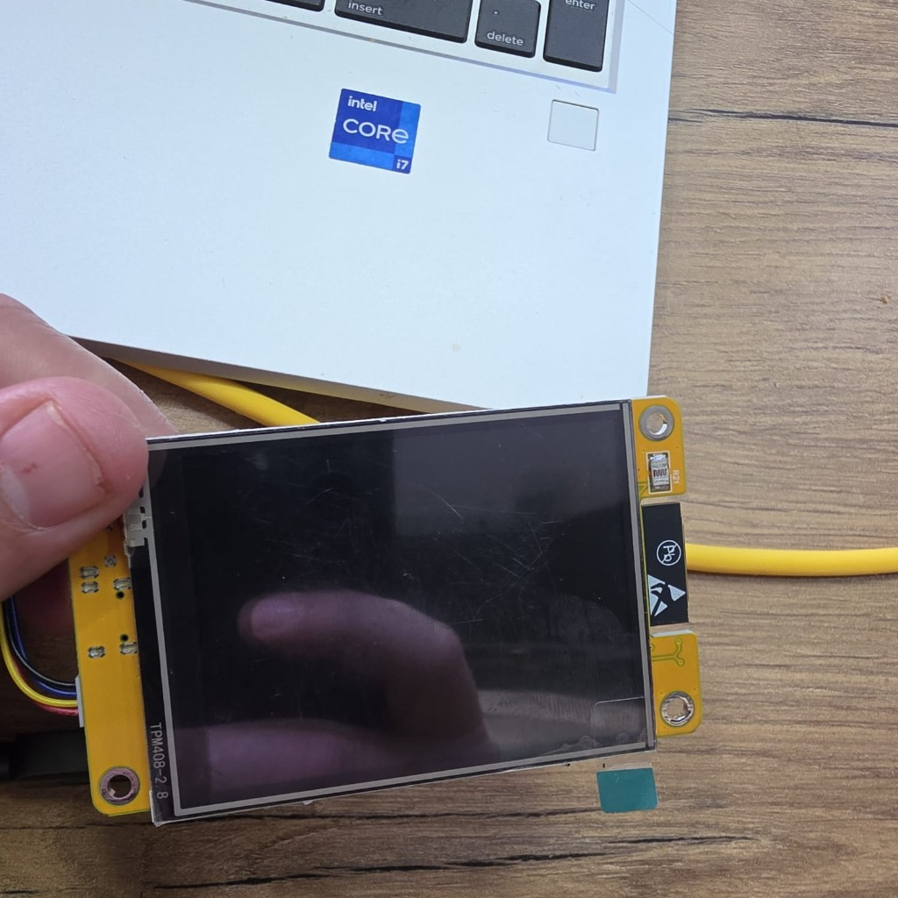
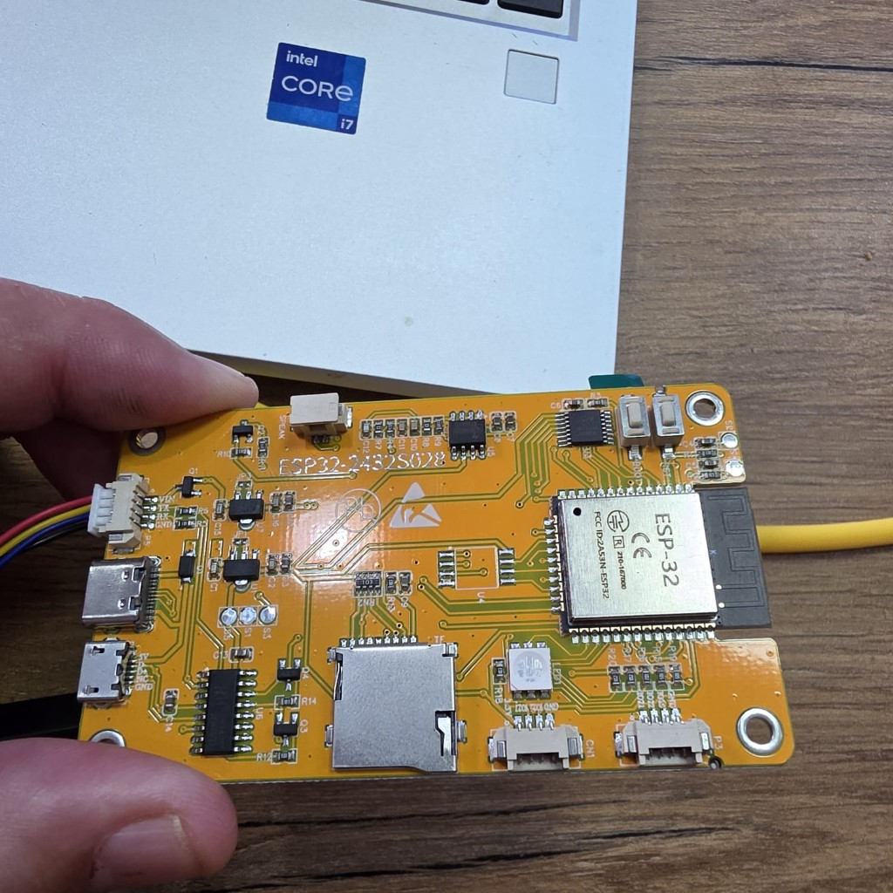
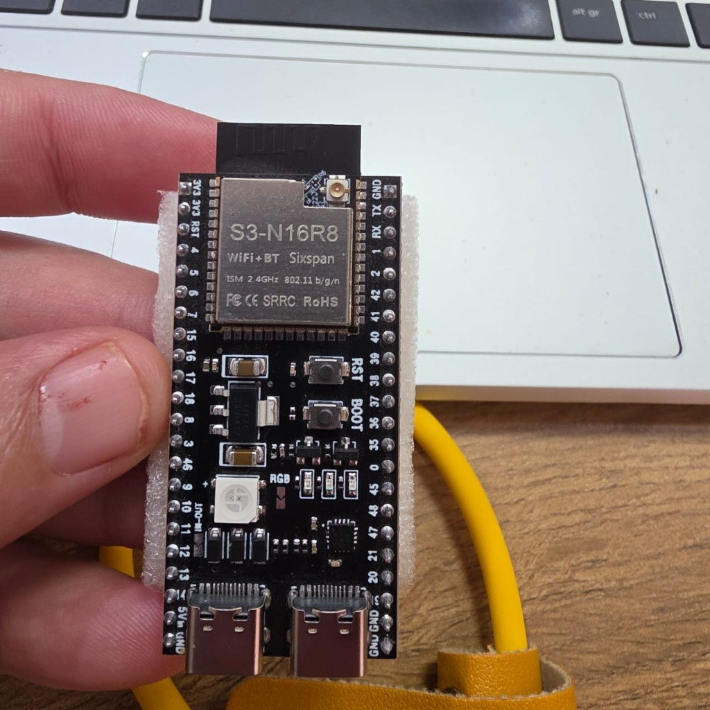
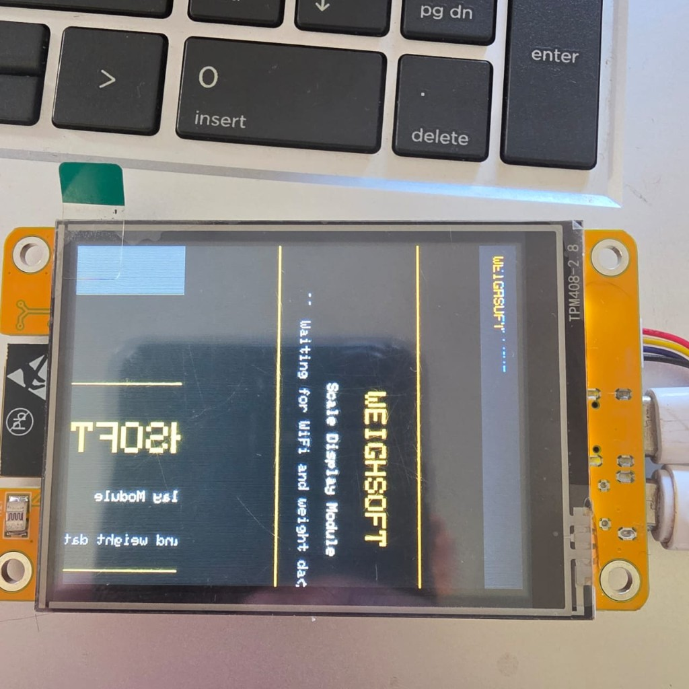
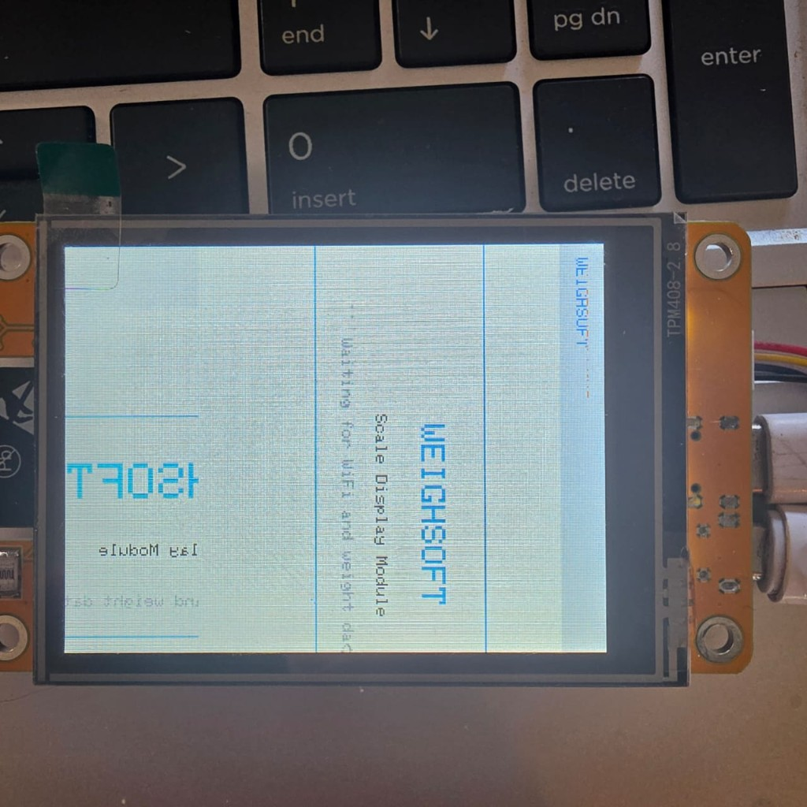
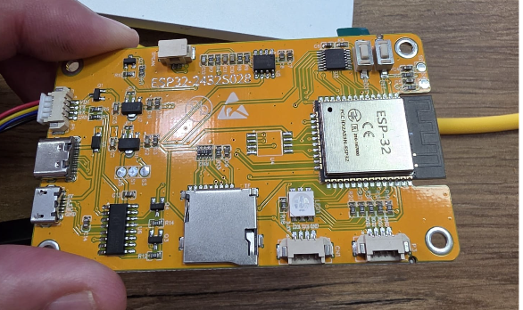

# Handover — `espReadWriteRHYNO` branch

> **Branch:** `espReadWriteRHYNO`  &nbsp;|&nbsp; **Base:** `master`  &nbsp;|&nbsp; **Last commit:** `655054a` (2026-04-28)
>
> If you're picking this work up cold, read the [PROJECT-OVERVIEW.md](PROJECT-OVERVIEW.md) first for the framework context, then come back here for the device-specific state.

## What this branch delivers

A two-(now three-)ESP weighing system:

- **Forwarder ESP** reads a scale on UART1, parses the weight line, and POSTs it to one or more remote receivers.
- **Remote ESP** receives weight POSTs, exposes them on REST + WebSocket, optionally echoes the raw scale line to its USB-CDC port (visible in ScaleCOM on the host PC), and survives indefinitely under sustained traffic.
- **CYD Display ESP** (Sunton ESP32-2432S028) does everything the Remote does, plus drives a 2.8" ILI9341 TFT showing the live weight value, a status bar, and the last raw scale line.

All three run the same firmware tree; the role is selected by:
- which PlatformIO env was flashed (`esp32s3` / `firebeetle32` / `cyd28`), and
- which services the user enables/configures via the React web UI at runtime.

## Live device roster

| Role | IP | MAC | PlatformIO env | Hardware |
|---|---|---|---|---|
| Forwarder | `192.168.2.71` | `44:1b:f6:ff:95:90` | `esp32s3` | Sixspan ESP32-S3 dev board (dual USB-C: native USB-CDC + on-board CH343 → UART0) |
| Remote receiver | `192.168.2.64` | `3c:dc:75:6c:24:64` | `esp32s3` | Same Sixspan ESP32-S3 dev board |
| Display (new) | DHCP / captive portal at first boot, then home WiFi | TBD | `cyd28` | Sunton ESP32-2432S028 ("CYD"), 2.8" ILI9341 |

WiFi: `Page Home` / `Monday@0111` (compiled into firmware via [factory_settings.ini](../factory_settings.ini)).
Admin REST creds: `admin` / `admin`.
OTA password: `esp-react`.

### How to talk to a device

```powershell
# Get a JWT
$L = Invoke-RestMethod -Uri "http://192.168.2.64/rest/signIn" `
    -Method Post `
    -Body (@{username='admin';password='admin'} | ConvertTo-Json) `
    -ContentType 'application/json'
$H = @{Authorization = "Bearer $($L.access_token)"}

# Inspect Remote receiver state
Invoke-RestMethod -Uri "http://192.168.2.64/rest/remoteWeight" -Headers $H

# Inspect audit log (heap, posts received, drops, recent events)
Invoke-RestMethod -Uri "http://192.168.2.64/rest/remoteWeightAudit" -Headers $H

# Inspect Forwarder config
Invoke-RestMethod -Uri "http://192.168.2.71/rest/weightForwarder" -Headers $H
```

## Architecture



Three production-critical fixes that landed this session live in the diagram:
- **heap-pressure guard** (drops POSTs early when free heap < 6 KB so the device never OOMs)
- **auto WS-client reaper** (every broadcast trims dead browser tabs so heap stays flat)
- **persist on config only, never on weight payloads** (the no.1 source of slow heap leaks)

## Files that matter

These are the files the next person will need to touch to keep this system alive.

### Backend (firmware)

| File | What it does |
|---|---|
| [src/main.cpp](../src/main.cpp) | Service wiring + main loop. Contains the **USB-CDC TX watchdog** that auto-recovers stuck HWCDC without a physical unplug. |
| [src/examples/weightforwarder/WeightForwarderService.cpp](../src/examples/weightforwarder/WeightForwarderService.cpp) | Reads scale via SerialService, debounces, sends via configured protocol(s). Multi-target HTTP with per-target backoff. USB echo path mirrors the raw line to Serial + Serial0. |
| [src/examples/weightforwarder/WeightForwarderState.h](../src/examples/weightforwarder/WeightForwarderState.h) | Up to 5 target URLs, per-target output formats (`STANDARD` / `LCD` / `TFT`), heartbeat interval, USB echo flag, BLE/WS/MQTT settings. |
| [src/examples/remoteweight/RemoteWeightService.cpp](../src/examples/remoteweight/RemoteWeightService.cpp) | Receives weight POSTs, runs the heap-pressure guard, periodic loop() does WS client cleanup + heap snapshot. Owns the `/rest/remoteWeightAudit` endpoint. |
| [src/examples/remoteweight/RemoteWeightService.h](../src/examples/remoteweight/RemoteWeightService.h) | `REMOTE_WEIGHT_MIN_FREE_HEAP=6000` (the OOM guard threshold), `REMOTE_WEIGHT_AUDIT_CAPACITY=20`, `REMOTE_WEIGHT_WS_CLEANUP_INTERVAL_MS=5000`. |
| [src/examples/remoteweight/RemoteWeightState.h](../src/examples/remoteweight/RemoteWeightState.h) | weight, lastLine, timestamp, enabled, displayEnabled, **usb_echo_enabled**. `update()` always marks weight payloads as CHANGED so the UI gets live updates. |
| [src/examples/display/DisplayService.cpp](../src/examples/display/DisplayService.cpp) | TFT renderer. Layout vars are now **runtime-derived** from `_tft.width()` / `_tft.height()` so the same code drives 480x320 ILI9488 and 320x240 ILI9341. |
| [src/examples/display/DisplayService.h](../src/examples/display/DisplayService.h) | Layout vars (`_w`, `_h`, `_statusBarH`, `_weightCenterY`, `_rawLineY`, text sizes) as instance members with sensible defaults. |
| [lib/framework/WebSocketTxRx.h](../lib/framework/WebSocketTxRx.h) | Added public `getWebSocket()` accessor + `maybeCleanupWebSocketClients()` helper that runs piggy-backed on every `transmitData()` call (throttled to once per 5 s). |

### Frontend (React UI)

| File | What it does |
|---|---|
| [interface/src/examples/weightforwarder/WeightForwarderConfig.tsx](../interface/src/examples/weightforwarder/WeightForwarderConfig.tsx) | Forwarder config form, multi-URL list, USB echo checkbox, heartbeat-interval input. |
| [interface/src/examples/remoteweight/RemoteWeightMonitor.tsx](../interface/src/examples/remoteweight/RemoteWeightMonitor.tsx) | Live weight display with WS subscription, USB echo toggle. |
| [interface/src/types/weightForwarder.ts](../interface/src/types/weightForwarder.ts) | TS types matching `WeightForwarderState`. |

### Build / config

| File | What it does |
|---|---|
| [platformio.ini](../platformio.ini) | Six envs now: `firebeetle32`, `esp12e`, `node32s`, `esp32dev`, **`cyd28` (new)**, `esp32s3`. The `esp32s3` env switches between USB and OTA upload — toggle the comment block in `[env:esp32s3]`. |
| [factory_settings.ini](../factory_settings.ini) | Default WiFi credentials, AP fallback, OTA password, NTP, JWT secret. |

## REST endpoints added on this branch

| Endpoint | Method | Auth | Purpose |
|---|---|---|---|
| `/rest/weightForwarder` | GET / POST | admin | Forwarder config (targets, heartbeat, USB echo, ...) |
| `/rest/remoteWeight` | GET / POST | admin | Remote receiver state (weight, lastLine, enabled, displayEnabled, usbEchoEnabled). POST is what the Forwarder calls. |
| `/rest/remoteWeightAudit` | GET | admin | Returns `{free_heap, min_heap_seen, max_alloc_heap, posts_total, posts_dropped, heap_threshold, ws_clients, last_seen_timestamp, entries[20]}`. The 20-entry ring buffer holds `{millis, free_heap, min_heap, max_alloc, posts_total, posts_dropped, ws_clients, reason}` events. |
| `/ws/weightForwarder` | WS | admin | Live forwarder status. |
| `/ws/remoteWeight` | WS | admin | Live weight push (every received POST). |

Audit reason codes:

| Code | Meaning |
|---|---|
| 0 | Periodic 30 s heap snapshot |
| 1 | POST received |
| 2 | POST dropped (heap pressure) |
| 3 | Echo fired |
| 4 | Weight value actually changed (triggers WS broadcast) |
| 5 | Service boot |

## Operational guards — why they exist

| Guard | Threshold | Why |
|---|---|---|
| Heap-pressure POST drop | free heap < 6 KB | True OOM danger zone. Without this, AsyncWebServer allocations would fail mid-request and panic. Higher thresholds (we tried 25 KB) reject during the normal 5 KB allocation swing — wrong. |
| HWCDC `setTxTimeoutMs(0)` | always | Default 250 ms timeout was blocking the AsyncTCP task on every echo, starving the web server. Zero = drop bytes immediately if no host is reading. |
| WS auto-cleanup | every 5 s on broadcast | Dead browser tabs leave their TX-queue buffers behind. Without periodic `cleanupClients()` they accumulate and fragment the heap. Lives in `WebSocketTxRx::maybeCleanupWebSocketClients()` so every service that uses `WebSocketTxRx` benefits, not just RemoteWeight. |
| Per-client `setCloseClientOnQueueFull(true)` | every 5 s on cleanup | If a client (slow tab) can't drain its queue, AsyncWebSocket closes the socket and next cleanup tick reaps it. Belt-and-suspenders against the leak source. |
| USB-CDC TX liveness watchdog | buffer < 64 B for >= 30 s | HWCDC's `connected` flag can stick at false after a brief host-side hiccup, leaving every `Serial.print()` silently dropped until the user unplugs/replugs the cable. Watchdog calls `Serial.end() + Serial.begin()` to force USB re-enumeration without losing the host's COM port handle. |
| FSPersistence on config changes only | `if (!isWeightUpdate)` in update handler | `writeToFS()` allocates a 1 KB JSON doc + opens the config file. Calling it on every weight POST = ~720 flash writes/hour and a slow heap leak that bottoms out around 23 KB. |

## Commit history this branch (newest first)

```
655054a feat: add cyd28 env (Sunton ESP32-2432S028) + responsive display layout
a837138 fix: auto-recover stuck USB-CDC TX without unplug/replug
12e4002 fix: stop persisting state on every weight POST + tune guard/log/audit
11ce0b9 fix: auto-reap stale WebSocket clients on every broadcast
ce9b936 fix: prevent Remote ESP heap exhaustion + add audit log
667b7ef fix: prevent USB-CDC echo from hanging the web server or being dropped
77e4204 feat: add USB COM-port echo toggle on Forwarder and Remote ESPs
0efb58f fix: only mark weight as forwarded on success to enable retry
2438866 fix: add weight debounce and per-target backoff to WeightForwarder
7c719d2 chore: clean up temp commit file
9f15dbc feat: add per-URL output format and service enable/disable toggles
54bd3e9 feat: add multi-URL support to WeightForwarder (up to 5 HTTP targets)
0ed5485 feat: update factory WiFi to Page Home network and fix SSID space escaping
```

Each commit on GitHub: `https://github.com/Kruger-Web-Solutions/Weighsoft.Hardware.Base/commit/<sha>`.

---

# Full session log (chronological)

This section is the chronological log of the work done in the current AI-assisted session. The first entries pre-date the work I personally walked through; they're included for completeness because they're part of the same branch story. Full conversation transcript: [Weight forwarder branch session](34a26902-1513-4b67-b96f-501393965d57).

## Phase 1 — Multi-URL Forwarder + per-URL formats (commits `54bd3e9`, `9f15dbc`)

Before this session opened, the Forwarder already supported a single HTTP target. Earlier in the same branch, support was added for:
- up to 5 simultaneous HTTP target URLs
- per-target output format (`STANDARD` JSON, `LCD` 16x2 padded, `TFT` rich)
- enable/disable toggle in the web UI

These commits live in the branch but predate the troubleshooting session below.

## Phase 2 — Debounce + per-target backoff (commits `2438866`, `0efb58f`)

Pre-existing fixes in the branch:
- `WEIGHT_DEBOUNCE_MS` floor so a wobbling scale doesn't fire 20 POSTs/sec
- `MIN_FORWARD_INTERVAL` hard floor (10 forwards/sec max)
- per-target fail counter + exponential backoff so a dead target doesn't block the others
- `last_forwarded_weight` only updated on a successful POST (so retries actually retry)

## Phase 3 — USB COM-port echo toggle (commit `77e4204`)

> *"we need to add a function that when a esp is conected to a PC with a usb it normaly creates a com port we need to get the wait/data ... must be able to togle on and of in the forwareder esp and the remote esp"*

Added a per-device `usb_echo_enabled` boolean that mirrors every received scale line to **both** transports:

- `Serial.println(line)` — USB-CDC (the ESP32-S3's native USB connector → COM3 in Windows)
- `Serial0.println(line)` — UART0 on GPIO43/44 (the Sixspan board's on-board CH343 → COM2 in Windows)

This required:

- Adding `usb_echo_enabled` to `RemoteWeightState` and `WeightForwarderState` (incl. JSON read/update + persistence)
- Adding the toggle to both the `WeightForwarderConfig.tsx` and `RemoteWeightMonitor.tsx` UI screens
- Setting `-D ARDUINO_USB_CDC_ON_BOOT=1 -D ARDUINO_USB_MODE=0` on the `esp32s3` env so `Serial` routes to USB-CDC
- Calling `Serial0.begin(SERIAL_BAUD_RATE)` explicitly in `setup()` because the framework no longer auto-inits UART0 once `Serial` is bound to USB-CDC
- Hooking the echo into `RemoteWeightService::addUpdateHandler` (every weight POST) and `WeightForwarderService::onSerialWeightUpdate` (every scale line read)

**Hardware insight surfaced during testing:** the Sixspan ESP32-S3 boards have **two USB-C connectors**, one wired to the chip's native USB-Serial-JTAG (COM3) and one routed through an on-board CH343 USB-UART chip to UART0 (COM2). Both connectors plug into the same chip, just into different transports. That's why the same ESP shows up as both COM2 and COM3 simultaneously when both cables are plugged in.

## Phase 4 — USB-CDC echo blocking the web server (commit `667b7ef`)

> *"the remote weigher http://192.168.2.64/ stop working"*

The first echo deployment caused the Remote to drop off the network after running steadily for a while. Diagnosis from the device's serial dump (heap dropping `21K → 12K`, then communication dies):

- HWCDC's `Serial.write()` has a 250 ms TX timeout by default.
- When no PC has the COM port open, the small TX FIFO fills and `Serial.println()` blocks for ~250 ms per call.
- The echo runs on the AsyncTCP request-handler task (called on every weight POST from the Forwarder).
- With the Forwarder hammering at heartbeat=1 s, AsyncTCP got 250 ms × 2 calls/POST = ~500 ms of blocking per second. The web server queue saturated → device unreachable.

**Fix:**
- `Serial.setTxTimeoutMs(0)` in `setup()` — non-blocking writes, drop bytes if buffer full.
- Removed the over-defensive `if (Serial)` gate I had briefly added in a previous attempt — `Serial`'s `operator bool` reflects DTR state, and ScaleCOM doesn't assert DTR, which would have silently swallowed the echo even though a reader was open.

## Phase 5 — Heap exhaustion under steady traffic + audit log (commit `ce9b936`)

> *"why does the remote weigher http://192.168.2.64/ stop working"* (recurring)

Even with the blocking fix, the Remote OOM-crashed after enough sustained traffic. Found via the serial dump that the heap was dropping `21K → 12K` over a couple of cycles, then deadlock.

**Root cause #1:** every weight POST triggered a `WebSocketTx::transmitData()` broadcast. With browser tabs left open holding stale WS connections, the per-broadcast `DynamicJsonDocument` + `AsyncWebSocketMessageBuffer` allocations fragmented the heap.

**Fix #1:** added `RemoteWeightService::loop()` that:
- Calls `_webSocket.cleanupClients()` every 5 s (reaps stale clients)
- Sets `setCloseClientOnQueueFull(true)` on every live client so a slow tab gets closed instead of accumulating
- Captures periodic heap snapshots into a 32-entry ring-buffer audit log
- Exposes the audit log via a new `/rest/remoteWeightAudit` endpoint

**Fix #2:** added a heap-pressure guard. If `ESP.getFreeHeap() < 25 KB` (later tuned down to 6 KB), drop the POST entirely instead of allocating WS broadcast buffers / FS write buffers / etc. Counted as `posts_dropped` in the audit.

**Framework change:** added a public `getWebSocket()` accessor in `WebSocketConnector` so application code can manage the underlying `AsyncWebSocket` without subclassing.

## Phase 6 — Auto-cleanup stale WS clients framework-wide (commit `11ce0b9`)

The Remote was now stable but the **Forwarder** was still leaking ~4 KB/s and crash-rebooting in a 30–45 s cycle, even with forwarding disabled. The leak was happening on a path that ran continuously regardless of forwarding state — most likely the `SerialService` → `/ws/serial` WebSocket broadcasts at ~2 Hz (every scale line), with stale browser tabs accumulating.

**Fix:** moved the cleanup from `RemoteWeightService` to `WebSocketTxRx::maybeCleanupWebSocketClients()`, called from `transmitData()` itself (throttled to once per 5 s). This way every service that uses `WebSocketTxRx` benefits — not just RemoteWeight.

## Phase 7 — Stop persisting on every POST + tune guards (commit `12e4002`)

> *"why is there a threshold? the sysem must run for weeks with out stopping. and we dont care about saving the data string"*

The user observed the heap-pressure guard kicking in continuously (`DROPPING POSTs` logs spamming the COM port, `posts_dropped` climbing). Investigation showed the Remote's free heap was sitting at `~23 KB` despite the WS auto-cleanup — suspiciously low for a device with no visible memory pressure source.

**Root cause:** my own commit `ce9b936` had introduced a regression. The new `addUpdateHandler` was calling `_fsPersistence.writeToFS()` on **every** state change, not just config changes. `writeToFS()` allocates a 1 KB `DynamicJsonDocument` and opens the config file every call. With the Forwarder pushing every 5 s, that's ~720 flash writes per hour and a slow heap leak.

**Fix:**
- Restored the `if (!isWeightUpdate)` gate (timestamp delta detection) so only **config-only** updates trigger flash writes; weight payloads skip persistence entirely.
- Lowered the OOM guard from 25 KB to 6 KB — true OOM danger only, doesn't fire during normal POST allocation swing.
- Rate-limited the "DROPPING POSTs" log to once per 5 s so it doesn't flood the COM port.
- Dropped audit ring buffer from 32 to 20 entries (~288 B saved) at the user's request: *"we really not need to save more the 20 weights"*.

After this fix, the Remote's heap went from `~23 KB` (rejecting POSTs) to **`~180 KB stable`** (zero drops) — see audit live capture at the time:

```
free_heap=182232  min_heap=185448  posts=2  dropped=0
free_heap=181804  min_heap=185448  posts=4  dropped=0
free_heap=181528  min_heap=185448  posts=5  dropped=0
free_heap=181352  min_heap=174200  posts=11  dropped=0
free_heap=180812  min_heap=174200  posts=13  dropped=0
free_heap=178528  min_heap=174200  posts=16  dropped=0
free_heap=177164  min_heap=180672  posts=14  dropped=0
free_heap=177960  min_heap=180024  posts=18  dropped=0
free_heap=176484  min_heap=180024  posts=12  dropped=0
free_heap=175536  min_heap=177972  posts=20  dropped=0
```

## Phase 8 — USB-CDC TX watchdog (commit `a837138`)

> *"why does the comport stop righting and the i need to conect and disconect before it starts again"*

Even with everything else fixed, ScaleCOM occasionally went silent on COM3 and required a USB cable unplug/replug to resume. Diagnosis (from reading the HWCDC driver source):

- HWCDC has an internal `connected` flag set/cleared via SOF interrupts and the `SERIAL_IN_EMPTY` ISR.
- After a brief host-side hiccup (Windows USB Selective Suspend, ScaleCOM read backpressure), `connected` flips to `false`.
- Once `connected = false`, every `Serial.write()` takes the "not connected" branch (HWCDC.cpp:419) which only buffers into the ring buffer and **never actually sends to USB**.
- HWCDC's recovery loop (HWCDC.cpp:441-470) only runs when `tx_timeout_ms > 0`, but we set it to 0 to avoid the AsyncTCP-blocking bug from Phase 4. So the recovery never runs, the COM port stays silent forever, and the only way back is USB re-enumeration.

**Fix:** small watchdog at the bottom of `loop()` in [src/main.cpp](../src/main.cpp). Polls `Serial.availableForWrite()` every 5 s. If the buffer stays saturated (< 64/256 B free) for >= 30 s, calls `Serial.end() → delay(50) → Serial.begin() → setTxTimeoutMs(0)` to force HWCDC re-init (which triggers USB BUS_RESET and re-enumeration). The host-side COM port handle stays valid because the device re-enumerates with the same VID/PID.

```cpp
#if ARDUINO_USB_CDC_ON_BOOT
{
  static unsigned long lastCdcCheck = 0;
  static unsigned long cdcStuckSince = 0;
  unsigned long now = millis();
  if (now - lastCdcCheck >= 5000UL) {
    lastCdcCheck = now;
    if (Serial.availableForWrite() < 64) {
      if (cdcStuckSince == 0) {
        cdcStuckSince = now;
      } else if (now - cdcStuckSince >= 30000UL) {
        Serial.end();
        delay(50);
        Serial.begin(SERIAL_BAUD_RATE);
        Serial.setTxTimeoutMs(0);
        Serial.println(F("[main] USB-CDC reset (was stuck for >=30s)"));
        cdcStuckSince = 0;
      }
    } else {
      cdcStuckSince = 0;
    }
  }
}
#endif
```

## Phase 9 — CYD board onboarding (commit `655054a`)

> *"ok see the screen shots attached its a new esp can we please write it aswell it i conected on com10"*

A new ESP arrived: a **Sunton ESP32-2432S028** (commonly called "Cheap Yellow Display" / CYD). 2.8" 320×240 ILI9341 TFT, XPT2046 resistive touch, microSD, two USB connectors (one CH340-bridged, one power-only), ESP32-WROOM-32 module.

| Front | Back |
|---|---|
|  |  |

The user wanted it as a **Remote Weight Display** — receive weight POSTs from the Forwarder, render on the TFT.

### Step 1: New `[env:cyd28]` PlatformIO env

Added to [platformio.ini](../platformio.ini). Standard CYD pinout (ILI9341 on HSPI 12/13/14, CS=15, DC=2, BL=21, RST tied to EN), XPT2046 touch on its own pins, COM10 for USB upload, 4 MB OTA partitions. SerialService UART1 + DiagnosticsService were moved off the touch pins (CYD touch uses GPIO 25/32/33/39) onto the I2C connector pads (GPIO 22/27, 4/16) to avoid clashes.

### Step 2: First boot — text rendering off the right edge

The CYD booted, all 10 services loaded, free heap 216 KB, TFT colour test ran, splash drew. **But:** `DisplayService` had hardcoded constants `DISP_W = 480, DISP_H = 320` everywhere, so on the 320 × 240 panel anything drawn at x ≥ 320 was clipped, and text positioned at `x = DISP_W/2 = 240` landed at the right edge instead of the centre.



### Step 3: Refactor `DisplayService` to runtime panel dimensions

Moved layout constants (`_w`, `_h`, `_statusBarH`, `_weightCenterY`, `_rawLineY`, text sizes) from file-scope `static constexpr` into instance members of `DisplayService`. In `begin()`, after `_tft.setRotation(1)`, populate from `_tft.width()` / `_tft.height()`:

```cpp
_w = _tft.width();
_h = _tft.height();
_statusBarH = max((int16_t)24, (int16_t)(_h * 11 / 100));
_rawLineY = _h - 18;
_weightCenterY = (_statusBarH + _rawLineY) / 2;
if (_w >= 400) {
  _titleTextSize = 3; _statusTextSize = 2; _weightTextSize = 6; _unitTextSize = 3;
} else {
  _titleTextSize = 2; _statusTextSize = 1; _weightTextSize = 5; _unitTextSize = 2;
}
```

Same code now drives both the 480×320 ILI9488 and the 320×240 CYD without anything overflowing. Boot log confirms: `[Display] Panel 320x240 statusH=26 weightCenterY=133 rawLineY=222`.

Also guarded the manual reset pulse with `#if defined(TFT_RST) && (TFT_RST >= 0)` so the CYD's `TFT_RST=-1` (panel reset tied to ESP32 EN line) doesn't crash.

### Step 4: Mirrored text + wrong colours

After the runtime-dimension fix, the layout was the right size but two new problems showed up:

- **Background was white/cream instead of black** (`COL_BG = TFT_BLACK = 0x0000` was rendering as light)
- **Text appeared mirrored** (W's vertices pointed up instead of down, etc.)

| Reflashed with runtime dimensions — colours wrong | After `invertDisplay(true)` — colours flipped, but text still mirrored |
|---|---|
|  |  |

| CYD board with the orange ESP32 module visible |
|---|
|  |

**Diagnosis:**
- *Mirrored text* — CYD's column-address (`MX`) bit is wired the opposite way to the standard ILI9341 wiring TFT_eSPI assumes. `setRotation(1)` produces a mirrored landscape; `setRotation(3)` (which flips both `MX` and `MY`) gives the right orientation.
- *Inverted colours* — the CYD panel ships with hardware colour inversion enabled at the controller level. Need to call `_tft.invertDisplay(true)` to flip it back to "normal".

### Step 5: CYD-specific compile flag

Added a new build flag `-DTFT_INVERT_DISPLAY=1` to the `cyd28` env. `DisplayService::begin()` checks for it:

```cpp
#if defined(TFT_INVERT_DISPLAY) && TFT_INVERT_DISPLAY
  _tft.invertDisplay(true);
  _tft.setRotation(3);  // CYD landscape with USB-C at top edge
#else
  _tft.setRotation(1);  // standard landscape (3.5" ILI9488)
#endif
```

The 3.5" ILI9488 env (`esp32dev`) is unaffected — it doesn't set the flag.

> **Open issue at handover time:** the latest user photo (Phase 9 step 4 above, right column) suggests `invertDisplay(true)` may need to be `invertDisplay(false)` on the user's specific CYD batch — different production batches of the CYD have shipped with the inversion bit set differently. If the next person sees a cream-coloured background after this commit, flip the boolean. The `setRotation(3)` change to fix mirroring is independent and should be correct regardless.

## Network capture during the session

| Snapshot | Time | What |
|---|---|---|
| `posts=590 dropped=0`, heap stable @ 180 KB | 2026-04-28 ~10:30 | Remote after Phase 7 deployment. Forwarder pushing every 5 s. |
| `Forwarder uptime=15s heap=136932 → 17228 → 5964` (crashed) | 2026-04-28 ~10:31 | Forwarder still leaking after Phase 6 — root cause is in the Forwarder's continuous-load path (suspect `SerialService` 2 Hz scale-line broadcasts with stale browser tabs on `/ws/serial`). |
| `[RemoteWeight] heap=178968 ... ws_clients=0 posts=80 dropped=0` | 2026-04-28 ~12:55 | Remote stable post all-fixes. |
| `[Display] Panel 320x240 statusH=26 weightCenterY=133 rawLineY=222` | 2026-04-28 ~13:20 | CYD running with runtime dimensions. |

## Known issues at handover

1. **Forwarder still has a 4 KB/s heap leak under continuous load.** Crash-restart cycle of ~30–45 s when scale data is flowing. Confirmed independent of HTTP forwarding (persists with forwarder disabled). Most likely source: `SerialService` triggers `/ws/serial` WS broadcasts at the scale line rate (~2 Hz). The framework-wide `WebSocketTxRx::maybeCleanupWebSocketClients()` from commit `11ce0b9` should be helping, but isn't enough on its own. **Next step:** add the same heap-pressure guard + audit pattern to `SerialService`, and consider throttling `/ws/serial` broadcasts to actual line changes only (the way `RemoteWeightState::update` was tuned).
2. **CYD colour inversion may need to be inverted-of-inverted.** See Phase 9 step 5 note above. Test with the CYD on your bench and flip `_tft.invertDisplay(true)` → `(false)` if needed.
3. **CYD WiFi auto-join sometimes fails on first boot** with `Reason code=202` (auth timeout). Device falls back to its captive portal AP. Manual workaround: connect a phone to `ESP8266-React-<chip-id>` AP, browse to `192.168.4.1`, configure WiFi. After that, credentials are saved and persistent.

## Next steps suggested

In rough priority order:

1. Fix the Forwarder's 4 KB/s leak — start by checking whether `SerialState::update()` has the same "always returns CHANGED" behaviour we deliberately keep on `RemoteWeightState`. If yes, throttle it to actual changes only, since the Forwarder's user-visible `/ws/serial` stream doesn't need every line.
2. Add the same `RemoteWeightAudit`-style observability to `WeightForwarderService` — heap snapshots, posts-sent counter, last-error tracking, periodic console summary.
3. Verify CYD colours on hardware after `invertDisplay(true)` — fix if needed.
4. Refactor `DisplayService` so the splash screen layout adjusts proportionally too — currently the y-offsets in `drawSplash()` (`cy ± 50`) work on both panels by luck more than design.
5. Wire the CYD into the Forwarder's target list once it's on home WiFi (Forwarder supports up to 5 HTTP targets).

## Quick recovery procedures

### Remote ESP unreachable
1. ARP scan: `arp -a | Select-String '3c-dc-75-6c-24-64'` to find current IP.
2. If genuinely offline: USB reset via the on-board CH343 (COM2):
   ```powershell
   python -m esptool --port COM2 --chip esp32s3 --before default-reset --after hard-reset chip-id
   ```
3. If COM2 is unplugged: USB-Serial-JTAG reset via COM3 (requires no other process holding COM3):
   ```powershell
   python -m esptool --port COM3 --chip esp32s3 --before usb-reset --after hard-reset chip-id
   ```
4. Wait 5–10 s for WiFi reconnect, then probe `/rest/features`.

### OTA flash (preferred, no USB needed)
1. Edit [platformio.ini](../platformio.ini) `[env:esp32s3]`: comment the `esptool` block, uncomment the `espota` block, set `upload_port = <device-ip>`.
2. `python -m platformio run -e esp32s3 -t upload`
3. Use `--auth=esp-react` (matches `factory_settings.ini`'s `FACTORY_OTA_PASSWORD`).

### Forwarder won't stop hammering Remote during diagnostics
```powershell
$L = Invoke-RestMethod -Uri "http://192.168.2.71/rest/signIn" -Method Post `
  -Body (@{username='admin';password='admin'}|ConvertTo-Json) -ContentType 'application/json'
$H = @{Authorization="Bearer $($L.access_token)"; 'Content-Type'='application/json'}
$cur = Invoke-RestMethod -Uri "http://192.168.2.71/rest/weightForwarder" -Headers @{Authorization="Bearer $($L.access_token)"}
$payload = @{ enabled = $false; protocol = $cur.protocol; target_urls = $cur.target_urls;
              target_formats = $cur.target_formats; auth_username = $cur.auth_username;
              auth_password = $cur.auth_password; heartbeat_interval_sec = $cur.heartbeat_interval_sec;
              usb_echo_enabled = $cur.usb_echo_enabled; ws_url = $cur.ws_url;
              mqtt_topic = $cur.mqtt_topic; ble_service_uuid = $cur.ble_service_uuid;
              ble_char_uuid = $cur.ble_char_uuid } | ConvertTo-Json -Depth 4
Invoke-RestMethod -Uri "http://192.168.2.71/rest/weightForwarder" -Method Post -Headers $H -Body $payload
```

### Watchdog tripped — check audit
```powershell
$L = Invoke-RestMethod -Uri "http://192.168.2.64/rest/signIn" -Method Post `
  -Body (@{username='admin';password='admin'}|ConvertTo-Json) -ContentType 'application/json'
Invoke-RestMethod -Uri "http://192.168.2.64/rest/remoteWeightAudit" -Headers @{Authorization="Bearer $($L.access_token)"} `
  | ConvertTo-Json -Depth 4
```
