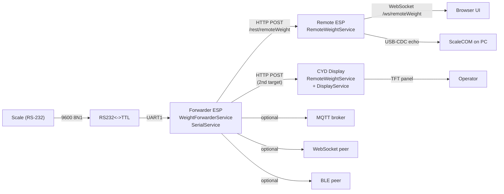

# Weighsoft.Hardware.Base — Project Overview

A multi-board ESP8266 / ESP32 firmware framework for weighbridge-related hardware: scale readers, weight forwarders, and remote weight displays. Built on the `esp8266-react` foundation with Weighsoft branding, JWT-secured REST + WebSocket API, OTA updates, and a Material-UI React front-end served from PROGMEM.

> This document is a project-wide map. For the active feature branch (Forwarder + Remote + CYD display weight system) see [HANDOVER-espReadWriteRHYNO.md](HANDOVER-espReadWriteRHYNO.md).

## Repository

- GitHub: <https://github.com/Kruger-Web-Solutions/Weighsoft.Hardware.Base>
- Default branch: `master`
- Active feature branch: `espReadWriteRHYNO` (the Forwarder/Remote/CYD weight system)

## What this firmware does

The same source tree builds firmware for several hardware roles, selected via PlatformIO build environments:

| Role | Description | Typical board |
|---|---|---|
| **Forwarder** | Reads a scale on a UART (RS-232 via TTL converter), parses the weight line, and pushes it over WiFi to one or more remote endpoints (HTTP / WebSocket / MQTT / BLE). | ESP32-S3, FireBeetle ESP32 |
| **Remote receiver** | Receives weight payloads via HTTP POST and exposes them on a REST/WebSocket API for UIs and downstream consumers. | ESP32-S3 |
| **Display module** | A Remote receiver with a TFT panel that shows the live weight, status bar, and last raw scale line. | ESP32-DevKit + 3.5" ILI9488, ESP32-2432S028 ("CYD") with 2.8" ILI9341 |
| **Diagnostics / config** | UART loopback / monitoring tooling and a generic LED example, useful as templates for new services. | any ESP32 |

All roles run the same firmware; the per-board PlatformIO env determines which pins, peripherals, and feature flags are compiled in.

## Build environments

Defined in [`platformio.ini`](../platformio.ini). Pick one with `pio run -e <name>`.

| `[env:...]` | Board | Flash | Display | Notes |
|---|---|---|---|---|
| `firebeetle32` | DFR0478 ESP32 | 4 MB | none | BLE disabled (no room with dual-OTA partitions). USB upload on COM10. **Default env.** |
| `esp12e` | ESP8266 (ESP-12E) | 4 MB | none | Legacy / minimal build. |
| `node32s` | ESP32 | 4 MB | none | BLE enabled, **no OTA** (single 3.3 MB factory partition). |
| `esp32dev` | ESP32 DevKit V1 | 4 MB | 3.5" ILI9488 (480x320) | TFT_eSPI, dual-OTA. |
| `cyd28` | Sunton ESP32-2432S028 ("CYD") | 4 MB | 2.8" ILI9341 (320x240) + XPT2046 touch | New in `espReadWriteRHYNO`. CH340 USB on COM10. |
| `esp32s3` | ESP32-S3 DevKitC-1 | 8 MB | none | BLE + dual-OTA. Native USB-CDC for serial. |

## Architecture in one diagram



## Top-level layout

```
Weighsoft.Hardware.Base/
├── src/                       # Application code
│   ├── main.cpp               # Service wiring + main loop + USB-CDC watchdog
│   ├── examples/
│   │   ├── weightforwarder/   # Reads scale, forwards weight (HTTP/WS/MQTT/BLE)
│   │   ├── remoteweight/      # Receives weight POSTs, exposes REST/WS, audit log
│   │   ├── display/           # TFT display driver (ILI9488 + ILI9341 / CYD)
│   │   ├── serial/            # Generic UART monitor + regex weight extractor
│   │   ├── diagnostics/       # UART loopback diagnostics
│   │   └── led/               # LED example service
│   ├── VersionService.{h,cpp} # /rest/version endpoint
│   ├── UartModeService.{h,cpp}# Switch UART between live monitor / loopback
│   └── version.h              # Build-time version + date stamp
├── lib/framework/             # esp8266-react framework (StatefulService, etc.)
├── interface/                 # React / Material-UI front-end (built into PROGMEM)
├── docs/                      # All project documentation
├── platformio.ini             # Per-env build / upload config
├── factory_settings.ini       # Compiled-in WiFi/AP/OTA defaults
├── features.ini               # Compile-time feature flags (FT_BLE, FT_OTA, ...)
└── partitions_*.csv           # Flash partition tables (4 MB single, 4 MB OTA, 8 MB BLE+OTA)
```

## Core design pattern

Every service follows the **`StatefulService<T>`** pattern from `lib/framework/`:

1. A plain state class `T` with `static read()` / `update()` JSON helpers.
2. The service inherits `StatefulService<T>` and **composes** infrastructure components (`HttpEndpoint`, `WebSocketTxRx`, `FSPersistence`, `MqttPubSub`, `BlePubSub`) — it does not inherit them.
3. State changes flow through `update(...)` which returns `CHANGED`, `UNCHANGED`, or `ERROR`. On `CHANGED`, registered update handlers fire.
4. Origin tracking (`originId` string) prevents echo loops between transports.

The canonical example is [`src/LightStateService.h`](../src/LightStateService.h). For a step-by-step extension guide see [EXTENSION-GUIDE.md](EXTENSION-GUIDE.md). For the full pattern catalog see [DESIGN-PATTERNS.md](DESIGN-PATTERNS.md).

## Branches

The repo uses long-lived **device-feature branches** rather than tags or release candidates. Each branch represents a specific hardware/role combination that's been customised away from `master`.

| Branch | Purpose | Status |
|---|---|---|
| `master` | Framework baseline, no device-specific customisation | maintained |
| `espReadWriteRHYNO` | Forwarder + Remote + CYD display weight system (the work documented in [HANDOVER-espReadWriteRHYNO.md](HANDOVER-espReadWriteRHYNO.md)) | **active** |
| `weighingboard` | Earlier weighing-board variant | snapshot |
| `serial`, `serialReader`, `serialWriter` | UART-focused variants | snapshots |
| `display` | Earlier 3.5" display work | snapshot |
| `growbox` | Grow-box hardware variant | snapshot |
| `serial2` | Alternate serial wiring | snapshot |

See [version-strategy.mdc](../.cursor/rules/version-strategy.mdc) and [feature-branch-workflow.mdc](../.cursor/rules/feature-branch-workflow.mdc) for the version + branch conventions.

## Configuration files

| File | What's in it |
|---|---|
| [platformio.ini](../platformio.ini) | Build envs, upload ports, build flags. **Edit per-env, don't add to root `[env]` block.** |
| [features.ini](../features.ini) | Compile-time feature toggles: `FT_BLE`, `FT_OTA`, `FT_NTP`, `FT_MQTT`, `FT_SECURITY`, etc. |
| [factory_settings.ini](../factory_settings.ini) | Default WiFi SSID/password (`Page Home` / `Monday@0111`), AP SSID, admin user, OTA password (`esp-react`), NTP server, etc. Compiled into firmware as `FACTORY_*` macros. |
| `partitions_*.csv` | Flash partition tables — `partitions_4mb_ota.csv` (dual app + LittleFS), `partitions_ble_ota.csv` (8 MB), `partitions_ble.csv` (4 MB BLE no-OTA). |

## Build & upload

PlatformIO is the only supported build system.

```powershell
# USB upload (default for most envs)
python -m platformio run -e cyd28 -t upload

# OTA upload (set upload_protocol=espota and upload_port=<device-ip> in platformio.ini)
python -m platformio run -e esp32s3 -t upload

# Serial monitor
python -m platformio device monitor -p COM10 -b 115200
```

When uploading, **always kill stale Python processes first** to free the COM port:

```powershell
Get-Process python* | Stop-Process -Force
python -m platformio run -e <env> -t upload
```

This is enforced by [`.cursor/rules/platformio-upload.mdc`](../.cursor/rules/platformio-upload.mdc) — the COM port stays held by an orphaned monitor often enough that it's worth a one-liner habit.

For wireless flashing of any device that's already on WiFi, see [OTA-UPLOAD.md](OTA-UPLOAD.md) — uses `espota.py` on UDP port 8266 with auth password `esp-react`.

## Default credentials

Compiled into the firmware via `factory_settings.ini`:

| Item | Value |
|---|---|
| WiFi SSID | `Page Home` |
| WiFi password | `Monday@0111` |
| AP SSID (fallback) | `ESP8266-React-<chip-id>` |
| AP password | `esp-react` |
| Admin REST username | `admin` |
| Admin REST password | `admin` |
| OTA upload password | `esp-react` |

## Documentation index

All docs live in `docs/`. Key entry points:

- **[ARCHITECTURE.md](ARCHITECTURE.md)** — high-level system architecture
- **[DESIGN-PATTERNS.md](DESIGN-PATTERNS.md)** — `StatefulService` and friends
- **[EXTENSION-GUIDE.md](EXTENSION-GUIDE.md)** — step-by-step "add a new service"
- **[API-REFERENCE.md](API-REFERENCE.md)** — REST + WebSocket endpoint catalog
- **[CONFIGURATION.md](CONFIGURATION.md)** — per-board partition + feature combinations
- **[OTA-UPLOAD.md](OTA-UPLOAD.md)** — wireless flashing
- **[PIN-CONFIGURATION.md](PIN-CONFIGURATION.md)** + **[PLATFORM-GPIO.md](PLATFORM-GPIO.md)** — per-board GPIO maps
- **[SECURITY.md](SECURITY.md)** — JWT + endpoint protection
- **[DATA-FLOWS.md](DATA-FLOWS.md)** + **[SEQUENCE-DIAGRAMS.md](SEQUENCE-DIAGRAMS.md)** — runtime behavior
- **[WEIGHT-FORWARDER-LESSONS.md](WEIGHT-FORWARDER-LESSONS.md)** — earlier-session lessons learned
- **[HANDOVER-espReadWriteRHYNO.md](HANDOVER-espReadWriteRHYNO.md)** — current branch state + chat history

## Project rules (`.cursor/rules/`)

These rules are enforced when working with the AI assistant in Cursor:

- `design-patterns.mdc` — must use `StatefulService`, no patchy workarounds
- `backend-service-pattern.mdc` — service implementation checklist
- `code-formatting.mdc` — clang-format / ESLint, no manual style debates
- `documentation.mdc` — all docs in `docs/`, no random `.md` files in root
- `partnership-communication.mdc` — discuss before implementing significant changes
- `windows-powershell-commands.mdc` — no bash heredoc / process substitution
- `platformio-upload.mdc` — kill Python processes before USB upload
- `project-structure.mdc` — keep root clean, code under `src/`/`lib/`
- `feature-branch-workflow.mdc` — how to create / merge device branches
- `version-strategy.mdc` — SemVer per-branch convention
- `ota-upload.mdc` — OTA on UDP port 8266
