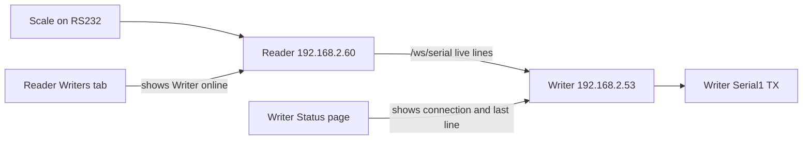

# Reader to Writer Setup

This checklist connects one Reader device to one Writer device with the Serial Reader Source feature.

## Known Bench Devices

| Role | Address | Purpose |
| --- | --- | --- |
| Reader | `http://192.168.2.60/` | Scale is connected here. It serves live serial lines from `/ws/serial`. |
| Writer | `http://192.168.2.53/` | Serial output device is connected here. It pulls lines from the Reader and writes them out. |

## Setup Steps

1. Open the Writer UI at `http://192.168.2.53/`.
2. Go to **Serial > Settings**.
3. In **Serial Reader Source**, paste the Reader web address: `http://192.168.2.60/`.
4. Click **Save Reader and Test Connection**.
5. Confirm the Writer banner turns green and says it is connected to `192.168.2.60`.
6. Open the Reader UI at `http://192.168.2.60/`.
7. Go to **Serial > Writers** and confirm the Writer appears online.

The Writer accepts either the web address (`http://192.168.2.60/`) or the WebSocket address (`ws://192.168.2.60/ws/serial`). The UI normalizes the web address to the live serial WebSocket endpoint when saving.

## Quick Test

1. Keep both devices powered and on the same WiFi network.
2. Send scale data into the Reader.
3. On the Writer, open **Serial > Status**.
4. Confirm **Serial Reader connection** is green and **Last received** shows the latest scale line.
5. Confirm **Writer output** shows the last sent line with source `reader`.

## Troubleshooting

| Symptom | Check |
| --- | --- |
| Writer says no Reader is set up | Open Writer **Serial > Settings**, paste the Reader address, and click **Save Reader and Test Connection**. |
| Writer keeps reconnecting | Confirm the Reader is powered, reachable at `http://192.168.2.60/`, and in Reader mode. |
| Reader does not list the Writer | Confirm the Writer Source URL points to the Reader and the Writer banner is green. |
| Writer connects but no data appears | Confirm the scale is sending data into Reader GPIO18 and Reader **Live Stream** shows lines. |
| Writer receives data but output device is quiet | Confirm Writer serial wiring, baud rate, data bits, parity, stop bits, and line ending under **Serial > Settings**. |

## Expected Data Flow

