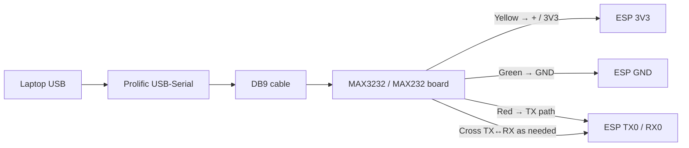
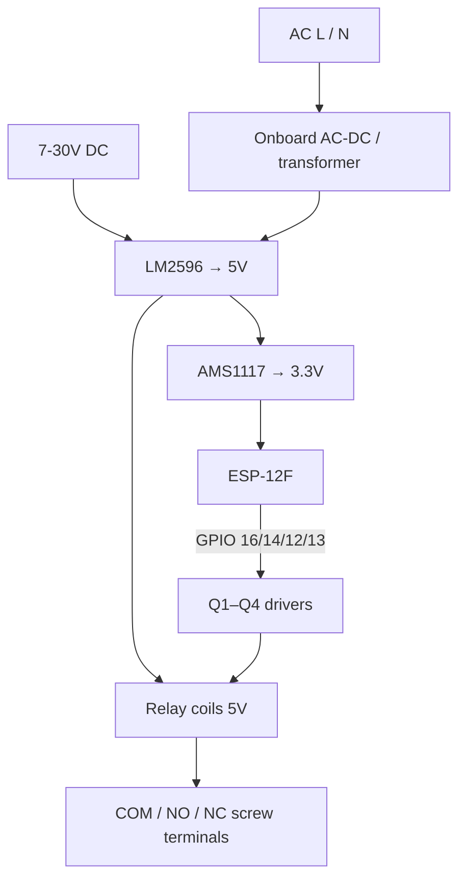
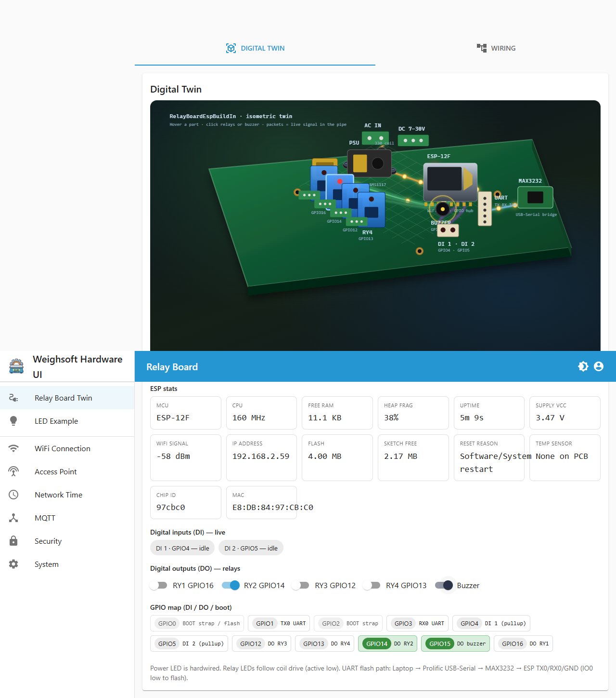

# Relay Board ESP Built-In (ESP-12F 4-Channel)

Integration branch: `RelayBoardEspBuildIn`

## Hardware inventory (from board photos)

| Item | Detail |
|------|--------|
| MCU | DOIT ESP-12F (ESP8266), onboard antenna |
| Relays | 4× Songle SRD-05VDC-SL-C (K1–K4 / RY1–RY4), 10A class |
| Drivers | Transistors Q1–Q4 + flyback diodes D9–D12 (typical) |
| Power | AC L/N terminal **and/or** DC 7–30V → LM2596 → 5V; AMS1117 → 3.3V for ESP |
| Status LED | Red power LED near TXD/GND/5V terminal (hardwired, not GPIO) |
| Relay LEDs | Per-channel indicators tied to relay drive |
| Programming | Header: TX0, RX0, GND, 3V3/5V, IO0; **RST** button |
| Breakouts | IO4, IO5, IO0, IO2, IO15, IO16, IO14, IO12, IO13 |
| Serial adapter path | Laptop USB → Prolific USB-Serial → DB9 → MAX3232/MAX232 board → ESP header |
| Onboard temp sensor | **None** on this PCB (twin reports supply VCC via ADC instead) |
| Buzzer | Firmware drives an active-high buzzer output on **GPIO15** (pulled low at boot, so silent on reset) |
| Digital inputs | **DI1 = GPIO4**, **DI2 = GPIO5** (INPUT_PULLUP — close pin to GND to trigger; polled every 50 ms, pushed live over WebSocket) |

## Default GPIO map (firmware)

LC-style ESP-12F 4-ch boards typically hard-wire:

| Relay | GPIO | Notes |
|-------|------|--------|
| RY1 | 16 | Safe for output |
| RY2 | 14 | |
| RY3 | 12 | |
| RY4 | 13 | |
| Buzzer | 15 | Active HIGH (GPIO15 is pulled low at boot) |
| DI1 | 4 | INPUT_PULLUP, close to GND = active |
| DI2 | 5 | INPUT_PULLUP, close to GND = active |
| Active level (relays) | **LOW = ON** | Opto/transistor drive (verify with click test) |

Avoid using GPIO0 / GPIO2 as outputs (boot strapping). GPIO15 is safe for an active-high load like the buzzer.

## Wiring diagram — programming / serial (photos)

### Header P4 (right of ESP-12F) — typical silk

| Pin | Function |
|-----|----------|
| 3V3 | Logic power (from board or carefully from adapter) |
| TX0 | ESP UART TX |
| RX0 | ESP UART RX |
| IO0 | Pull **LOW** during reset to enter flash mode |
| GND | Common ground |
| 5V | 5V rail (do not feed ESP I/O at 5V) |

**Flash tip:** Hold IO0→GND, press RST (or power-cycle), then upload. Release IO0 after flash starts.

### Windows COM note

PnP may show **Prolific USB-to-Serial Comm Port (COM3)** while pyserial lists the same device as **COM2** if Bluetooth already claimed COM3. Prefer the Prolific VID `067B:2303` port reported by `python -m serial.tools.list_ports`.

## Wiring diagram — power & loads

## Digital twin

In the web UI: **Project → Relay Board Twin**

- Isometric 3D board view: relays, PSU, transformer + caps, ESP-12F, UART header, buzzer, DI header, mounting holes
- Live DO (relays + buzzer) control via WebSocket; animated signal packets on power / UART / GPIO / DI pipes
- Live DI 1 / DI 2 state (GPIO4 / GPIO5), pushed from firmware every 50 ms on change
- ESP stats: heap, fragmentation, uptime, supply VCC, WiFi RSSI, IP, MAC, reset reason, flash, chip ID
- Wiring tab with this diagram

