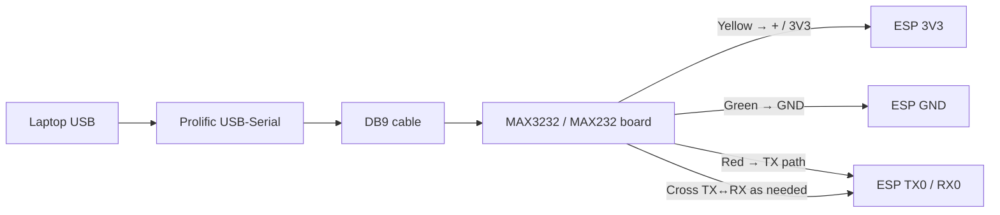
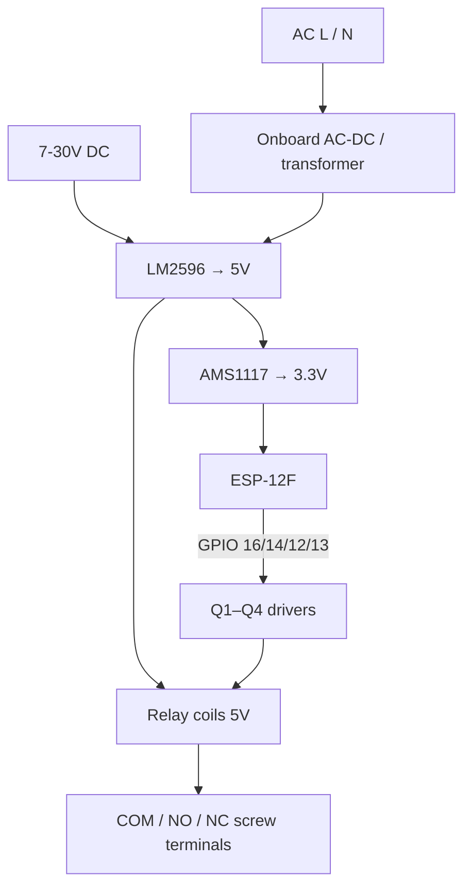

# Relay Board ESP Built-In (ESP-12F 4-Channel)

Integration branch: `RelayBoardEspBuildIn`

Board identification: **ESP12F_Relay_X4** aka **LC-Relay-ESP12-4R-MV** (93×87 mm).
References: [Tasmota template](https://templates.blakadder.com/ESP12F_Relay_X4.html),
[ESPHome device page](https://devices.esphome.io/devices/ESP-12F-Relay-X4/), vendor datasheet.

Key facts confirmed from documentation:

- Relay drive is **active HIGH** through jumper caps: RY1–RY4 pads sit next to GPIO16/14/12/13
  headers; any GPIO can drive any relay with a DuPont wire instead of the cap.
- **GPIO16 pulses briefly at power-up** (hardware quirk), so RY1 clicks once at boot.
  Community workaround: move the RY1 jumper to GPIO15 (unused for firmware outputs).
- **GPIO5 carries the board's blue LED** (inverted) and GPIO2 the ESP module LED.
- ADC pin exposed (0–1 V input range) — our firmware uses ADC in VCC mode instead.
- Relays: Songle SRD-05VDC-SL-C, 10 A dry contacts (COM/NO/NC), AC 250 V / DC 30 V loads.
- Power: AC 90–250 V, DC 7–30 V, or 5 V (separate inputs). RST button onboard.
- IO4/IO5 are the usual I2C pins for add-ons (OLED, RTC) if the DIs are ever repurposed.

## Hardware inventory (from board photos)

| Item | Detail |
|------|--------|
| MCU | DOIT ESP-12F (ESP8266), onboard antenna |
| Relays | 4× Songle SRD-05VDC-SL-C (K1–K4 / RY1–RY4), 10A class |
| Drivers | Transistors Q1–Q4 + flyback diodes D9–D12 (typical) |
| Power | AC L/N terminal **and/or** DC 7–30V → LM2596 → 5V; AMS1117 → 3.3V for ESP |
| Status LED | Red power LED near TXD/GND/5V terminal (hardwired, not GPIO) |
| Relay LEDs | Per-channel indicators tied to relay drive |
| Programming | Header: TX0, RX0, GND, 3V3/5V, IO0; **RST** button |
| Breakouts | IO4, IO5, IO0, IO2, IO15, IO16, IO14, IO12, IO13 |
| Serial adapter path | Laptop USB → Prolific USB-Serial → DB9 → MAX3232/MAX232 board → ESP header |
| Onboard temp sensor | **None** on this PCB (twin reports supply VCC via ADC instead) |
| Buzzer | **Not used** — no firmware support (GPIO15 left as boot strap / free) |
| Digital inputs | **DI1 = GPIO4**, **DI2 = GPIO5** (INPUT_PULLUP — close pin to GND to trigger; polled every 50 ms). Mapped in Live Weight to Print / Next / Start / Stop / None. |

## Default GPIO map (firmware)

LC-style ESP-12F 4-ch boards typically hard-wire:

| Relay | GPIO | Notes |
|-------|------|--------|
| RY1 | 16 | Safe for output |
| RY2 | 14 | |
| RY3 | 12 | |
| RY4 | 13 | |
| DI1 | 4 | INPUT_PULLUP, close to GND = active |
| DI2 | 5 | INPUT_PULLUP, close to GND = active |
| Active level (relays) | **HIGH = ON** | Transistor drive via jumper caps (per Tasmota/ESPHome configs) |

Avoid using GPIO0 / GPIO2 / GPIO15 as outputs unless you know the boot-strap rules.

## Wiring diagram — programming / serial (photos)

### Header P4 (right of ESP-12F) — typical silk

| Pin | Function |
|-----|----------|
| 3V3 | Logic power (from board or carefully from adapter) |
| TX0 | ESP UART TX |
| RX0 | ESP UART RX |
| IO0 | Pull **LOW** during reset to enter flash mode |
| GND | Common ground |
| 5V | 5V rail (do not feed ESP I/O at 5V) |

**Flash tip:** Hold IO0→GND, press RST (or power-cycle), then upload. Release IO0 after flash starts.

### Windows COM note

PnP may show **Prolific USB-to-Serial Comm Port (COM3)** while pyserial lists the same device as **COM2** if Bluetooth already claimed COM3. Prefer the Prolific VID `067B:2303` port reported by `python -m serial.tools.list_ports`.

## Wiring diagram — power & loads

## Live Weight

In the web UI: **Project → Live Weight**

| Tab | Who | Content |
|-----|-----|---------|
| **Live** | all | Big scale dial + Net weight + read-only PLU strip |
| **Target & Relays** | all | Range low/high, UNDER/CORRECT/OVER → RY maps, DI1/DI2 actions, network printer IP:9100 |
| **Product** | all | PLU, description, piece count, total |
| **Tech** | admin | Weight source, baud, regex, test weight |
| **How it connects** | admin | Connection help |

**Range control:** Weight under → `relay_low` (default RY1), in range → `relay_ok` (RY2), over → `relay_high` (RY3). Only one of those three relays is on.

**DI actions:** rising edge (pin to GND) → `print` | `next` | `start` | `stop` | `none`.  
**Print:** short TCP ESC/POS ticket to configured printer IP (port 9100). Fail soft if offline.  
**Next:** increments piece `count` (total = count × weight).

One service, multiple ways in (no duplicate weight UIs):

| Source | How it works |
|--------|----------------|
| Serial (RS-232) | Scale → MAX3232 / PROG header → UART0. Baud + optional custom regex. Ingest caps: 128 B lines, ≤64 bytes/loop, publish ≤5 Hz, change-gated; default parse is simple numeric (no POSIX regex every line). |
| WiFi / WebSocket | `POST /rest/liveWeight` or `/ws/liveWeight` with `{ weight, last_line }`. |
| RS-485 | **Not available** on this board (no free pins / transceiver). |

Endpoints: `/rest/liveWeight`, `/ws/liveWeight`.

## Digital twin

In the web UI: **Project → Relay Board Twin**

- Isometric 3D board view: relays, PSU, transformer + caps, ESP-12F, UART header, DI header, mounting holes
- Live DO (relays) control via WebSocket; animated signal packets on power / UART / GPIO / DI pipes
- Live DI 1 / DI 2 state (GPIO4 / GPIO5), with Live Weight action labels when configured
- ESP stats: heap, fragmentation, uptime, supply VCC, WiFi RSSI, IP, MAC, reset reason, flash, chip ID
- Wiring tab with this diagram

