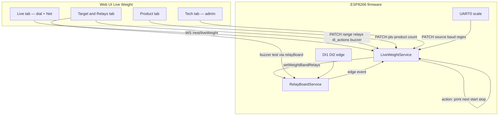
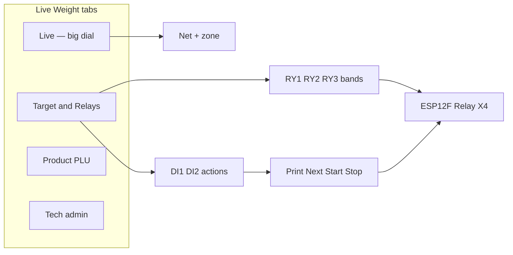

# Handoff: Live Weight operator UI + DI actions + buzzer (RelayBoardEspBuildIn)

**Date:** 2026-08-08  
**Mode:** `/WeighsoftResearch` — read-only research → agent handoff (build = separate `/weighsoftSwarm`)  
**Branch:** `RelayBoardEspBuildIn`  
**Repo:** `Weighsoft.Hardware.Base`  
**Hardware:** ESP12F_Relay_X4 / LC-Relay-ESP12-4R-MV (ESP8266)

---

## 0. Question pinned

Ship a **clear, modern navy/blue Live Weight operator experience** on this relay board:

1. **Live** = big scale dial + net weight only (easy to read).
2. **Target & Relays** = range + UNDER/CORRECT/OVER → RY mapping + buzzer test + **DI action maps**.
3. **Product** = PLU / description / count (total derived).
4. **Tech** = admin source/baud/regex (rename of today’s Setup).
5. Firmware: **buzzer tone fix** (flash), **DI1/DI2 → selectable actions** (Print / Next / Start / Stop / None).
6. Twin: keep improved board look; show DI action labels when configured.

**Out of scope for this job:** Bluetooth (no BLE on ESP8266), RS-485 hardware, Home Assistant store listing, new PCB.

**Approved design mocks (assets):**

- `assets/live-weight-dial-only-mockup.png`
- `assets/target-relays-tab-mockup.png`
- `assets/product-plu-tab-mockup.png`
- `assets/relay-twin-realboard-mockup.png` (prior twin target)

---

## 1. What exists today (cited)

### Live Weight firmware

| Item | Fact | Source |
|------|------|--------|
| State | Weight, zone, source/baud/regex, range + 3 relay maps, PLU/product/count/total | `src/examples/liveweight/LiveWeightState.h` |
| REST / WS | `/rest/liveWeight`, `/ws/liveWeight` | `LiveWeightService.h` |
| Persist | `/config/liveWeight.json` via `readConfig`/`updateConfig` | `LiveWeightService.cpp` |
| Band → relays | `evaluateBandAndDrive` → `RelayBoardService::setWeightBandRelays` | `LiveWeightService.cpp`, `RelayBoardService.cpp` |
| Sources | Serial UART0, WiFi REST/WS, RS-485 **stub** (`rs485_ready` always false) | `LiveWeightState.h` ~124; `LiveWeightService.cpp` |
| MQTT | `MqttPubSub` topic `weighsoft/liveWeight/#{unique_id}/data` + `/set` | `LiveWeightService.cpp` |
| Regex | POSIX `regcomp`/`regexec` + simple fallback | `LiveWeightService.cpp` |

### Live Weight UI

| Item | Fact | Source |
|------|------|--------|
| Tabs | Live / Setup / How it connects | `interface/src/examples/liveweight/LiveWeight.tsx` |
| Live content | Scale grid **plus** “Your job setup” (range+relays **and** product) | `LiveWeightScreen.tsx` |
| Gauge | `RangeGauge` SVG; CSS max ~280px | `LiveWeightScreen.tsx` ~42–101; `liveWeight.css` |
| Navy vars | `--lw-blue: #0b3d66`, `--lw-blue-deep: #062844` | `liveWeight.css` |
| Menu | Project → Live Weight | `ProjectMenu.tsx`, `ProjectRouting.tsx` |

### Relay board / DI / buzzer

| Item | Fact | Source |
|------|------|--------|
| Relays | GPIO 16/14/12/13, **active HIGH** | `RelayBoardService.h`, `docs/RELAY-BOARD-ESP-BUILT-IN.md` |
| DI1 / DI2 | GPIO4 / GPIO5, INPUT_PULLUP, active LOW to GND, 50 ms poll | `RelayBoardService.cpp` ~46–87 |
| DI over API | Booleans only; **no action mapping** | same + UI twin |
| Buzzer | GPIO15; `RELAY_BOARD_HAS_BUZZER=1` on `esp12e`; **`tone()` / `noTone()`** in code | `RelayBoardService.cpp` ~152–160; `platformio.ini` |
| Twin | `/ws/relayBoard` + isometric SVG | `RelayBoardDigitalTwin.tsx`, `RelayBoardTwin3D.tsx` |

### Docs drift

Current board doc still says Live tab includes job setup (`docs/RELAY-BOARD-ESP-BUILT-IN.md` ~100–105) — must update when UI ships.

---

## 2. Competitor / operator UX (external)

Industrial terminals keep **weighing screen separate from setup**, and map **digital inputs to keys** (Print, Tare, Zero, Clear, etc.):

- Human-centric weighing UI: large readable values, one primary job per screen, visual + audible feedback — [Weighing Review](https://weighingreview.com/content/human-centric-design-weighing-interfaces).
- Rice Lake 1280 UX: one primary action per screen; use size/color for dominance — [Rice Lake design practices](https://www.ricelake.com/resources/sales-literature/1280-enterprise-series-design-practices-for-intuitive-user-experience/).
- Mettler IND425 / IND439: digital inputs configurable to OFF / Zero / Tare / Print / Clear / Unit — [IND425 operator manual](https://www.nefton.gr/files/pdf/IND425-Operator%20Manual-EN.pdf), [MT IND439 PDF](https://www.mt.com/dam/mt_ext_files/Editorial/Generic/5/BA_IND439_Editorial-Generic_1133200444907_files/22013806b.pdf).
- IT4000E: DI for zero/tare/print; setpoints for range — [IT4000E datasheet](https://deska.lt/wp-content/uploads/2026/06/IT4000E_CONTROL_ONLINE_DBE.pdf).

**Recommendation aligned with field practice:** Live = read-only instrument; Target & Relays owns setpoints + DI key map; Product owns PLU; Tech owns link settings.

**Action set for this board (approved in design talk):** Print | Next | Start | Stop | None  
(Not full Mettler set — only what the WOW / Live Weight job needs now. Tare/Zero can be phase 2.)

---

## 3. Hardware / OS / upgrade posture

| Topic | Decision | Why |
|-------|----------|-----|
| MCU | Stay on ESP8266 ESP-12F | This board; no BLE |
| Flash path | COM Prolific + IO0→GND + RST | WiFi OTA often fails (heap/firewall); see board doc |
| Buzzer | Add-on on GPIO15; drive with **`tone(2000)`** | Passive piezos silent on steady HIGH |
| DI | Keep GPIO4/5; edge-detect on press (LOW) | Already wired |
| RS-485 | **Remove from product UI**; leave stub code optional cleanup | No free pins / no transceiver |
| MQTT | **Disable for this product build** (`FT_MQTT=0` or strip Live Weight MQTT) | User asked remove; heap relief |
| Regex | Prefer **simple numeric parser** for serial; keep regex optional or drop if heap bites | POSIX regex costly on ESP8266 |
| Upgrade | Flash after UI+DI+buzzer in one firmware drop | Avoid half-flashed tone fix |

**Safe now:** UI tab split, dial, DI action state + edge handlers, buzzer flash, docs.  
**Hold:** BLE, RS-485 hardware, HA marketplace.  
**Risky:** Unbounded WS publish on every serial line / every DI poll without debounce/rate limit.

---

## 4. Recommended architecture (ONE path)



### Data ownership

| Owner service | Owns |
|---------------|------|
| `LiveWeightService` | Weight, zone, range, relay maps, PLU fields, **di1_action / di2_action**, action events / counters |
| `RelayBoardService` | Physical relays, raw DI levels, buzzer pin, twin status |
| Overlap | Band relays: Live Weight **commands** Relay Board. DI: Relay Board **detects**, Live Weight **interprets** via configured actions. |

### DI action semantics (decisive)

On **rising edge** (contact close: pin goes active / LOW), debounce ≥50 ms (already poll interval), fire once:

| Action | Firmware / UI effect (v1) |
|--------|---------------------------|
| `none` | Ignore |
| `print` | Set `last_action = "print"`, bump `action_seq`, push WS, then **open short TCP to configured printer IP:port** and send a small ESC/POS ticket (PLU, product, weight, count, total). Close socket. Fail soft if offline. |
| `next` | Increment `count` by 1, refresh `total`, persist config subset, push WS |
| `start` | Set `job_running = true`, status “Job started”, push WS |
| `stop` | Set `job_running = false`, status “Job stopped”, push WS |

Persist actions with Live Weight config JSON:

```json
"di1_action": "print",
"di2_action": "next",
"job_running": false,
"last_action": "",
"action_seq": 0,
"printer_ip": "192.168.x.x",
"printer_port": 9100,
"printer_enabled": true
```

**Print path (locked 2026-08-08):** Printer **has a LAN IP**. Best practice on ESP8266 = raw TCP to **port 9100** (ESC/POS), short ticket, close. Not IPP / cloud / Windows drivers. Flash headroom ~140 KB is enough; keep RAM use burst-only. UI: printer IP + port + enable on **Target & Relays** or **Tech**.

Wire Relay Board → Live Weight with a small callback or friend hook from `pollInputs()` on change-to-active only (not level spam).

### UI information architecture

| Tab | Route | Who | Content |
|-----|-------|-----|---------|
| Live | `live` | all | Hero dial (≥ min(90vw, 520px)), Net, Gross/Zone chips, **read-only** PLU strip |
| Target & Relays | `target` | all | Range on/off, low/high, 3 relay cards, DI1/DI2 action selects, buzzer test |
| Product | `product` | all | PLU, description, count, total (read-only), Save |
| Tech | `tech` | admin | Source, baud, regex, test weight, history (today’s Setup) |
| Info | keep or fold into Tech | admin | Connection help |

Visual system: extend `liveWeight.css` navy tokens; apply same tokens to Target/Product/Tech cards. No purple gradients.

### Twin

- Keep isometric layout improvements.
- Label DI pads with configured action when Live Weight state available (already dual-WS in twin).
- Buzzer tip: “GPIO15 — tone 2 kHz when on”.

### Cleanup in same swarm (stability)

1. Remove RS-485 from Tech UI options (or mark disabled permanently).
2. Turn off MQTT for this env / Live Weight if still linked (`features.ini` currently `FT_MQTT=1`).
3. Rate-limit Live Weight WS pushes (e.g. zone/weight change or ≤5 Hz).
4. Prefer simple weight parse; avoid `regcomp` every line if possible.
5. Update `docs/RELAY-BOARD-ESP-BUILT-IN.md` Live Weight section to new tabs + DI actions.

---

## 5. Agent integration rules (do / do-not)

**Do**

- Work on branch **`RelayBoardEspBuildIn`**.
- Keep `StatefulService` patterns; no direct `_state` writes.
- Compose endpoints; do not invent parallel weight APIs.
- Format with clang-format / ESLint.
- Kill Python before COM upload (`Get-Process python* | Stop-Process -Force`).
- Match approved mocks for tab split and dial size.

**Do not**

- Add BLE / Bluetooth.
- Claim RS-485 works.
- Change relay active level (must stay HIGH).
- Put range/PLU editors back on Live.
- Commit secrets or force-push.
- Touch unrelated integrations (`serial2`, `display`, weighingboard) unless needed for compile.

**Where code lives**

- Firmware: `src/examples/liveweight/*`, `src/examples/relay/*`, `src/main.cpp`
- UI: `interface/src/examples/liveweight/*`, twin under `interface/src/examples/relay/*`
- Docs: `docs/RELAY-BOARD-ESP-BUILT-IN.md` + this spec
- Mock: `scripts/relay-twin-mock-server.js` (extend DI/action fields if used)

---

## 6. Build checklist (for `/weighsoftSwarm`)

### Firmware

- [ ] Persist `di1_action`, `di2_action`, `job_running`; expose `last_action`, `action_seq` in `read()`
- [ ] Edge callback from RelayBoard DI → LiveWeight action handler
- [ ] Confirm buzzer uses `tone`/`noTone`; flash `esp12e`
- [ ] WS rate limit + optional simple parser path
- [ ] MQTT off or unused for this product drop
- [ ] RS-485 not offered as working source in UI

### Frontend

- [ ] Four tabs: Live / Target & Relays / Product / Tech
- [ ] Live: hero dial, no setup forms
- [ ] Target: range, relays, DI actions, buzzer test
- [ ] Product: PLU form only
- [ ] Navy styling across tabs
- [ ] Twin DI labels optional polish
- [ ] Types + mock server field parity

### Verify on device

- [ ] Dial readable; zone colors match UNDER/OK/OVER
- [ ] Relays follow band
- [ ] DI1/DI2 close-to-GND fires configured action once per press
- [ ] Buzzer audible when toggled
- [ ] Heap after boot logged; no rapid restart under serial traffic

---

## 7. Risks and open questions

| Risk | Mitigation |
|------|------------|
| Heap / WDT with Live Weight + WS | Rate limit; drop MQTT; simplify parse |
| GPIO5 = DI2 and board blue LED shared | Document; DI2 still usable as input |
| Printer offline / wrong IP | Fail soft; status “Print failed”; board stays up |
| Active vs passive buzzer | `tone()` covers both; wire SIG→IO15, GND→GND |
| Doc says buzzer “active high” vs `tone()` | Update docs to match firmware |

**Resolved:**

1. **Next** = piece `count++` (total = count × weight), unless later changed.
2. **Print** = network ESC/POS to **printer IP** (default port **9100**) + WS event. Printer has an IP (confirmed).

**Still open (non-blocking):** default printer IP to put in the form, or leave blank until you type it on Tech / Target & Relays.

---

## 8. Visual summary



---

## 9. Stop condition

This handoff is **decisive**: tab IA, DI action set, buzzer path, ownership, cleanup, and verify list are fixed.  
**No product code was built in the research pass.**  
Next step: `/weighsoftSwarm` (or explicit “build it”) on `RelayBoardEspBuildIn` implementing §6.
